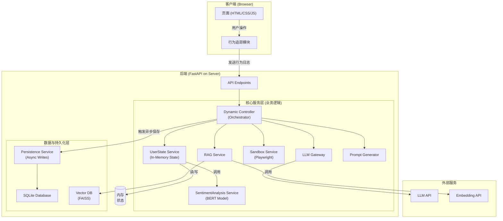
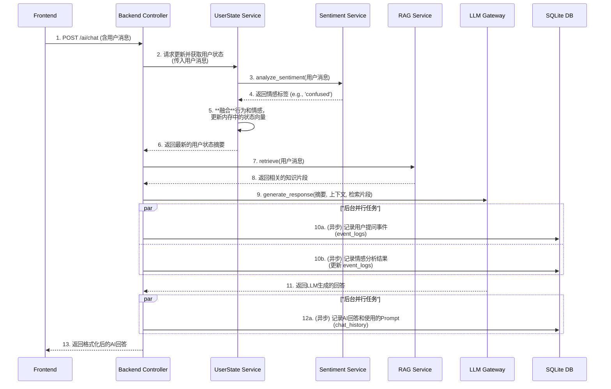
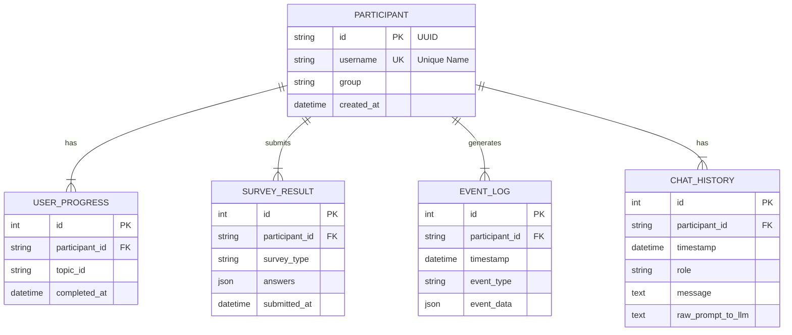

### 技术设计文档 (TDD) - V1.2

**项目名称:** 自适应动态AI教学系统
**版本:** 1.2
**日期:** 2025-7-28
**作者:** 曹欣卓
**状态:** **最终版 (Final)**

---

### **1. 简介 (Introduction)**

#### **1.1. 背景与目标 (Background and Goals)**

*   **问题陈述:** 本项目旨在解决传统AI教学系统中“静态反馈”的弊端。静态教程无法实时感知学习者的**认知状态**（如困惑、掌握）、**行为状态**（如胡乱尝试）和**情感状态**（如挫败、好奇），导致学习效率低下和负面体验。本项目将为 ACM CHI 会议构建并验证一个“人-AI 动态学习闭环”系统。
*   **目标:**
    *   **科研目标:** 通过A/B对照实验，证明本系统（实验组）在学习效果、认知负荷及用户体验上，显著优于无动态模型的静态AI系统（对照组）。
    *   **技术目标:** 构建一个稳定、高性能的实验平台。该平台能通过**行为追踪、代码评测和自然语言情感分析**，实时构建全面的学习者模型，并驱动LLM生成真正个性化的反馈。

#### **1.2. 关键术语与定义 (Glossary/Terminology)**

*   **学习者状态向量 (Learner State Vector):** 一个内存中的Python对象，实时聚合了描述当前学习者的所有关键信息。它由三部分构成：
    1.  **认知状态:** 基于BKT模型，评估对知识点的掌握程度。
    2.  **行为状态:** 基于操作日志的规则引擎，推断用户的行为模式（如迷茫、专注）。
    3.  **情感状态:** 基于BERT模型，分析用户聊天文本中表达的情感。
*   **RAG (Retrieval-Augmented Generation):** 检索增强生成。在生成回答前，先从一个权威的向量知识库中检索相关信息，以增强LLM回答的准确性。
*   **Playwright Sandbox:** 利用无头浏览器（Playwright）创建的安全沙箱环境，用于在服务器端隔离执行和评测用户提交的前端代码。

---

### **2. 整体设计 (High-Level Design)**

#### **2.1. 系统架构图 (System Architecture Diagram)**



#### **2.2. 核心数据流：增强版自适应AI对话**



#### **2.3. 技术选型 (Technology Stack)**

| 类别         | 技术选型                  | 理由                                |
| :--------- | :-------------------- | :-------------------------------- |
| **后端框架**   | **FastAPI**           | 高性能，原生异步，自带交互式API文档。              |
| **前端**     | **原生 HTML/CSS/JS**    | 轻量，无框架复杂性，满足实验系统需求。               |
| **数据库**    | **SQLite**            | 零配置，单文件，完美平衡开发简便性与数据严谨性。          |
| **ORM**    | **SQLAlchemy**        | 成熟、强大的Python ORM，与FastAPI集成良好。    |
| **配置管理**   | **Pydantic-Settings** | 自动从`.env`加载配置并进行类型校验。             |
| **代码评测沙箱** | **Playwright**        | 提供了真实、安全的浏览器环境来执行用户代码，远胜于`vm`库。   |
| **向量数据库**  | **FAISS (CPU)**       | 极高性能的相似度搜索库，可作为文件存储，非常适合本项目。      |
| **代码编辑器**  | **Monaco Editor**     | VS Code核心组件，提供一流的编码体验（语法高亮、静态检查）。 |

#### **2.4. 项目文件结构 (Project Structure)**

```
adaptive-tutor-system/
│
├── backend/
│   ├── app/
│   │   ├── api/              # API路由/端点
│   │   │   └── endpoints/    # (session.py, chat.py, etc.)
│   │   ├── core/             # 配置 (config.py)
│   │   ├── crud/             # 数据库交互 (crud_participant.py, etc.)
│   │   ├── data/             # 存放知识库/问卷等静态数据
│   │   │   ├── knowledge_graph.json
│   │   │   ├── surveys/
│   │   │   ├── kb.faiss      # 向量索引
│   │   │   ├── kb_chunks.json
|	|	|	├── learning_content/
|	|   |   |     ├── html_intro.json
|	|   |   |     ├── div_span.json
|	|   |   |     └── ...
|	|   |   └── test_tasks/
|	|	|	     ├── html_intro.json
|	|	|	     ├── div_span.json
|	|	|	     └── ...
│   │   ├── db/               # 数据库会话管理
│   │   ├── models/           # SQLAlchemy数据模型
│   │   ├── schemas/          # Pydantic数据校验模型
│   │   └── services/         # **核心业务逻辑**
│   │       ├── dynamic_controller.py
│   │       ├── user_state_service.py
│   │       ├── sentiment_analysis_service.py
│   │       ├── rag_service.py
│   │       ├── sandbox_service.py
│   │       ├── llm_gateway.py
│   │       └── prompt_generator.py
│   │
│   │   └── main.py           # FastAPI应用入口
│   │
│   └── scripts/              # 辅助脚本
│       ├── build_knowledge_base.py
│       └── download_models.py # <--- (推荐) 用于下载BERT模型
│
├── frontend/
│   ├── css/
│   ├── js/
│   │   ├── modules/          # **核心逻辑模块**
│   │   │   ├── session.js
│   │   │   ├── behavior_tracker.js
│   │   │   ├── chat_ui.js
│   │   │   └── live_preview.js
│   │   ├── pages/            # 页面专属逻辑
│   │   │   ├── registration.js
│   │   │   ├── knowledge_graph.js
│   │   │   ├── test_page.js
│   │   │   └── ...
│   │   └── api_client.js     # (推荐) API请求封装
│   │
│   └── (index.html, survey.html, etc.)
│
├── data/
│   └── experiment_data.db    # SQLite数据库文件
│
└── .env / .env.example
```


### **3. 详细设计 (Detailed Design)**

这一部分将定义我们系统的数据如何存储，以及组件之间如何通过API进行通信。
#### **3.1. 数据库设计 (Database Design)**

##### **3.1.1. 实体关系图 (ER Diagram)**



##### **3.1.2. 表结构定义 (Table Schemas)**

*   **`participants` 表**
    *   **用途:** 存储每个实验参与者的基本信息。
    *   **字段:**
        *   `id` (TEXT, PRIMARY KEY): 系统生成的唯一ID (UUID)。
        *   `username` (TEXT, UNIQUE, NOT NULL): 用户提供的可读名称。
        *   `group` (TEXT, NOT NULL): 实验分组，'experimental' 或 'control'。
        *   `created_at` (DATETIME): 记录创建时间。

*   **`user_progress` 表**
    *   **用途:** 高效地记录和查询用户已完成的知识点。
    *   **字段:**
        *   `id` (INTEGER, PRIMARY KEY, AUTOINCREMENT): 自增ID。
        *   `participant_id` (TEXT, FOREIGN KEY): 关联到 `participants.id`。
        *   `topic_id` (TEXT, NOT NULL): 已完成的知识点ID。
        *   `completed_at` (DATETIME): 完成时间。

*   **`event_logs` 表**
    *   **用途:** **科研核心数据源**。记录所有由前端发送的、结构化的原始行为痕迹。
    *   **字段:**
        *   `id` (INTEGER, PRIMARY KEY, AUTOINCREMENT): 事件唯一ID。
        *   `participant_id` (TEXT, FOREIGN KEY): 关联。
        *   `timestamp` (DATETIME, NOT NULL): 事件发生的精确时间。
        *   `event_type` (TEXT, NOT NULL): 事件类型，如 `code_edit`, `ai_chat`, `submit_test`。
        *   `event_data` (JSON): 包含事件所有细节的JSON对象。**（设计决策：对于`ai_chat`事件，此字段可包含情感分析结果）**

*   **`chat_history` 表**
    *   **用途:** 专门记录用户与AI的完整对话历史，以及用于生成AI回答的Prompt。
    *   **字段:**
        *   `id` (INTEGER, PRIMARY KEY, AUTOINCREMENT): 消息ID。
        *   `participant_id` (TEXT, FOREIGN KEY): 关联。
        *   `timestamp` (DATETIME, NOT NULL): 消息时间。
        *   `role` (TEXT, NOT NULL): 'user' 或 'ai'。
        *   `message` (TEXT, NOT NULL): 消息的文本内容。
        *   `raw_prompt_to_llm` (TEXT): **(仅对AI消息)** 记录当时为了生成这条AI回答，我们实际发送给LLM的完整Prompt。这对复现和分析LLM行为至关重要。

*   **`survey_results` 表**
    *   **用途:** 存储用户提交的所有问卷结果。
    *   **字段:**
        *   `id` (INTEGER, PRIMARY KEY, AUTOINCREMENT): 提交记录ID。
        *   `participant_id` (TEXT, FOREIGN KEY): 关联。
        *   `survey_type` (TEXT, NOT NULL): 问卷类型, 如 'pre-test', 'post-test', 'nasa-tlx'。
        *   `answers` (JSON, NOT NULL): 存储用户提交的完整答案的JSON对象。
        *   `submitted_at` (DATETIME): 提交时间。

---

#### **3.2. API 接口规范 (API Specification)**

这是我们系统中所有API端点的定义。所有端点均以 `/api/v1` 为前缀，并遵循TDD-03中定义的标准响应结构。

| 方法 | 路径 | 简要描述 |
| :--- | :--- | :--- |
| `POST` | `/session/initiate` | **会话启动/注册**。根据`username`创建或登录用户。 |
| `GET` | `/knowledge-graph` | 获取**静态知识图谱**结构（节点和依赖边）。 |
| `GET` | `/participants/{id}/progress` | 获取指定用户的**学习进度**（已完成的知识点列表）。 |
| `GET` | `/learning-content/{topic_id}` | 获取指定知识点的**学习材料**（代码、Markdown等）。 |
| `GET` | `/test-tasks/{topic_id}` | 获取指定知识点的**测试任务**详情（描述、起始代码、检查点）。 |
| `POST` | `/ai/chat` | **核心AI对话接口**。发送用户消息和完整上下文，获取自适应回复。 |
| `POST` | `/submit-test` | **提交测试代码**，由后端安全沙箱进行评测。 |
| `POST` | `/behavior/log` | **记录用户行为**。由前端的全局追踪器调用，后端进行异步处理。 |
| `GET` | `/surveys/{type}` | 获取指定类型的**问卷结构**。 |
| `POST` | `/surveys/submit` | **提交问卷答案**。 |
| `GET` | `/config` | 获取前端运行所需的安全配置（目前为空，为未来预留）。 |

*注：每个API的详细请求体(Request Body)和响应体(Response Body)的Pydantic Schema将在各自的二级TDD中详细定义。这份顶层文档只负责列出端点及其核心职责。*

---

#### **3.3. 非功能性需求概要 (Non-Functional Requirements Summary)**

*   **性能 (Performance):**
    *   高频接口 (`/behavior/log`) 必须异步处理，响应时间 < 50ms。
    *   AI对话接口 (`/ai/chat`) 的服务端处理时间（不含LLM调用）应 < 300ms。
*   **安全性 (Security):**
    *   所有敏感配置（API Keys）必须通过环境变量加载。
    *   用户代码评测必须在**Playwright沙箱**中进行，与服务器文件系统和网络完全隔离。
    *   所有API输入都必须通过Pydantic模型进行严格校验。
*   **可靠性 (Reliability):**
    *   关键的数据写入操作（事件、问卷）必须是事务性的（由SQLite保证）。
    *   对外部服务（LLM API）的调用必须有合理的重试和超时机制。
*   **可观测性 (Observability):**
    *   应用应配置结构化日志，记录所有API请求、关键决策和错误。
    *   提供一个 `/health` 端点用于健康检查。


### 二级技术设计文档 (TDD) 

**组织方式:** 我将把相关的API和功能组织成逻辑上的“功能模块”，并按推荐的开发顺序进行排序。

---

#### **第一部分：基础框架与会话管理**

_(这是系统的入口和基础)_

- **TDD-II-01: 全局环境与配置**
    - **涵盖:** `.env`文件管理，后端`Pydantic-Settings`配置加载，前端安全配置接口 (`GET /config`)。
- **TDD-II-02: 用户注册与会话启动**
    - **涵盖:** `POST /session/initiate` 的完整前后端逻辑，`localStorage`的使用，数据库`participants`表的交互。

#### **第二部分：核心内容与学习流程**

_(构建用户能看到和交互的核心学习路径)_

- **TDD-II-03: 知识图谱系统**
    - **涵盖:** `GET /knowledge-graph` (静态结构) 和 `GET /participants/{id}/progress` (动态进度) 两个API。前端的状态计算引擎（Completed, Unlocked, Locked）和图谱渲染逻辑。
- **TDD-II-04: 学习与测试内容服务**
    - **涵盖:** `GET /learning-content/{topic_id}` 和 `GET /test-tasks/{topic_id}` 两个API。重点在于定义和管理作为静态JSON文件的学习/测试材料。
- **TDD-II-05: 核心学习界面 (页面2)**
    - **涵盖:** 页面初始化、多窗口联动 (`<iframe>` postMessage)、以及与`live_preview.js`模块的集成。
- **TDD-II-06: 编码测试界面 (页面3)**
    - **涵盖:** 实时预览集成、代码提交逻辑 (`POST /submit-test`)，以及与后端`SandboxService`的交互。

#### **第三部分：自适应核心与后台系统**

_(这是系统的brain，是项目的创新点所在)_

- **TDD-II-07: 行为追踪与日志系统**
    - **涵盖:** 前端`behavior_tracker.js`模块的设计（捕获哪些事件，如何发送），后端`POST /behavior/log`端点的实现（异步持久化）。
- **TDD-II-08: 安全代码评测沙箱 (SandboxService)**
    - **涵盖:** `SandboxService`的详细设计，如何使用Playwright加载用户代码、执行检查点并返回结果。这是`POST /submit-test`的后端核心实现。
- **TDD-II-09: RAG与情感分析服务**
    - **涵盖:** `RAGService`的详细设计（FAISS索引加载与查询），以及`SentimentAnalysisService`的设计（BERT模型加载与推理）。
- **TDD-II-10: 最终的AI对话核心流程**
    - **涵盖:** 这是最重要的TDD之一。详细设计`POST /ai/chat`的后端完整流程，串联起`UserStateService`, `SentimentAnalysisService`, `RAGService`, `PromptGenerator`, `LLMGateway`，并详细说明`PromptGenerator`如何融合所有信息。

#### **第四部分：科研数据与实验支持**

_(确保我们能完成科研目标)_

- **TDD-II-11: 问卷系统**
    - **涵盖:** `GET /surveys/{type}` 和 `POST /surveys/submit` 两个API。前端问卷的动态渲染和提交逻辑，以及在主流程中的整合。