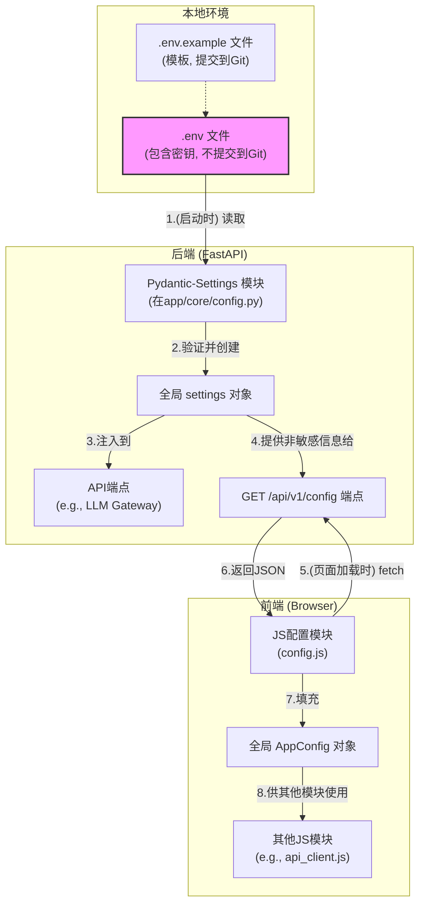

### **详细技术设计文档 (TDD-II-01): 全局环境与配置**

**版本:** 1.2
**关联的顶层TDD:** V1.2 - 章节 2.3 (技术选型), 2.4 (项目结构)
**作者:** 曹欣卓
**日期:** 2025-7-28

#### **1. 功能概述 (Feature Overview)**

**目标:** 为整个项目（前端和后端）建立一个统一、安全、灵活的配置管理机制。所有环境相关的变量（如端口、API密钥）都应与代码库分离，以增强安全性并简化在不同环境（开发、测试、生产）中的部署。

**核心原则:**
*   **代码与配置分离:** 严格将配置存储在环境中。
*   **单一事实来源:** `.env` 文件是所有本地开发配置的唯一来源。
*   **安全:** 敏感信息（如API密钥）绝不提交到版本控制系统。

**范围:**
1.  定义 `.env` 文件的结构和管理方式。
2.  设计后端 FastAPI 应用加载和验证配置的详细实现。
3.  设计前端应用通过安全API端点 (`GET /api/v1/config`) 获取非敏感配置的流程。

#### **2. 设计与实现**

##### **2.1. 配置流程图**



##### **2.2. `.env` 文件管理**

*   **位置:** 项目根目录 `.env`
*   **模板 (`.env.example`):**
```env
# .env.example - Copy to .env and fill in your values for local development.

# -- Backend Server --
BACKEND_PORT=8000

# -- OpenAI API --
OPENAI_API_KEY="your_secret_key_here" 
OPENAI_MODEL="gpt-4o-mini"
OPENAI_API_BASE="https://api.openai.com/v1"

# -- Embedding Model --
EMBEDDING_MODEL="text-embedding-3-small"
```
  
*   **安全要求:** 必须将 `.env` 添加到 `.gitignore` 文件中。

##### **2.3. 后端配置实现 (FastAPI & Pydantic-Settings)**

*   **依赖安装:** `poetry` `pydantic-settings`
*   **配置文件 (`backend/app/core/config.py`):**
```python
# backend/app/core/config.py
from pydantic_settings import BaseSettings, SettingsConfigDict
import os

class Settings(BaseSettings):
	"""
	Loads all application settings from environment variables or a .env file.
	The validation is handled by Pydantic.
	"""
	# Server
	BACKEND_PORT: int = 8000

	# OpenAI
	OPENAI_API_KEY: str
	OPENAI_MODEL: str = "gpt-4-turbo"
	OPENAI_API_BASE: str = "https://api.openai.com/v1"
  
	# Embedding
	EMBEDDING_MODEL: str = "text-embedding-3-small"

	# Model configuration tells Pydantic where to find the .env file.
	# It will search from the current working directory upwards.
	model_config = SettingsConfigDict(env_file=".env", env_file_encoding='utf-8', extra='ignore')

# Create a single, globally accessible instance of the settings.
# This will raise a validation error on startup if required settings are missing.
settings = Settings()
```
*   **使用:** 在任何需要配置的地方，直接 `from app.core.config import settings`。

说明：当 `settings = Settings()` 这行代码运行时，`pydantic-settings` 会按照以下**从高到低的优先级**顺序去寻找配置项的值：
1. **系统环境变量 (System Environment Variables):** 程序运行时环境中已经存在的变量。这是最高优先级。
2. **`.env` 文件中定义的变量:** `model_config = SettingsConfigDict(env_file=".env", ...)` 这行代码告诉 Pydantic 去读取项目根目录下的 `.env` 文件。
3. **Python 代码中定义的默认值:** `Settings` 类中直接賦值的变量，例如 `BACKEND_PORT: int = 8000`。这是最低的优先级，作为保底的默认选项。

##### **2.4. 前端安全配置接口**

*   **API端点 (`GET /api/v1/config`):**
    这个端点**绝不能**泄露任何敏感信息。它只提供前端运行可能需要的、完全安全的公共信息。

*   **Pydantic Schema (`backend/app/schemas/config.py`):**
```python
# backend/app/schemas/config.py
from pydantic import BaseModel

class FrontendConfig(BaseModel):
	"""
	Defines the non-sensitive configuration variables
	that will be exposed to the frontend.
	"""
	# 示例: 如果前端需要知道当前实验使用的模型名（非敏感）
	# model_name_for_display: str
	pass # 目前，前端不需要任何后端配置，但结构已备好。
```
**关键点分析：**
- `class FrontendConfig(BaseModel):`: 使用 Pydantic 的 `BaseModel` 来创建一个数据模型。Pydantic 会自动处理数据校验和序列化（比如将对象转为 JSON）。
- `pass`: 关键字 `pass` 表示这个类目前是一个空壳。这意味着，根据当前的状态，**不允许任何配置信息**被发送到前端。这是一种非常安全的默认状态。
- `# model_name_for_display: str`: 这是一个被注释掉的示例，用于说明如何扩展这份协议。如果你取消这行注释，就意味着你声明了 `model_name_for_display` 这个字符串类型的字段是安全的，可以发送给前端。

*   **端点实现 (`backend/app/api/endpoints/config.py`):**
```python
# backend/app/api/endpoints/config.py
from fastapi import APIRouter
from app.core.config import settings
from app.schemas.config import FrontendConfig
from app.schemas.response import StandardResponse # 使用标准响应

router = APIRouter()

@router.get("/config", response_model=StandardResponse[FrontendConfig])
def get_frontend_config():
	"""
	Provides a safe, non-sensitive set of configuration
	variables to the frontend application.
	"""
	config_data = FrontendConfig(
		# model_name_for_display=settings.OPENAI_MODEL
	)
	return StandardResponse(data=config_data)
```
- 作用
    - 它是一个后端的触发器。当浏览器的前端应用请求 `GET /api/v1/config` 时，这个触发器就会被唤醒。
    - 它的职责是，从后端庞大的配置信息（`settings`）中，**仅仅挑选出** 上面👆`FrontendConfig` 里约定的那几项，然后交给前端。
- 关键点分析：
    - `@router.get("/config", ...)`: 创建一个 HTTP GET 端点，URL 路径是 `/config`。
    - `response_model=StandardResponse[FrontendConfig]`: 这是 **FastAPI 的一个核心安全特性**。它强制要求这个函数的返回值**必须**符合 `FrontendConfig` 的结构。如果你的代码不小心试图返回一个包含 `OPENAI_API_KEY` 的对象，FastAPI 会发现它不符合 `FrontendConfig` 的“合同”，并直接阻止这个响应，从而防止了敏感信息泄露。
    - `config_data = FrontendConfig(...)`: 这里，代码创建了一个 `FrontendConfig` 类的实例。注意，括号里是空的，这与 `FrontendConfig` 类是空壳的定义相匹配。
    - `# model_name_for_display=settings.OPENAI_MODEL`: 同样，这是一个被注释掉的示例。如果你在 `FrontendConfig` 类中启用了 `model_name_for_display` 字段，你就可以在这里取消注释。这行代码的作用是：
        1. 从总配置 `settings` 中读取 `OPENAI_MODEL` 的值（例如 `"gpt-4o-mini"`）。
        2. 将这个值赋给 `FrontendConfig` 实例的 `model_name_for_display` 字段。
    - `return StandardResponse(data=config_data)`: 将创建好的、只包含安全信息的 `config_data` 对象，包装在一个标准响应体中返回。
##### **2.5. 前端获取配置实现**

*   **JS模块 (`frontend/js/modules/config.js`):**
```javascript
// frontend/js/modules/config.js

// A globally accessible object to hold configuration.
export const AppConfig = {};

/**
 * Fetches configuration from the backend.
 * Should be called once when the application starts.
 */
export async function initializeConfig() {
  try {
	const response = await fetch('/api/v1/config');
	const result = await response.json();
  
	if (result.code !== 200) {
		throw new Error(result.message);
	}
  
	Object.assign(AppConfig, result.data);
	console.log("Frontend configuration loaded:", AppConfig);
  } catch (error) {
	console.error("Could not initialize frontend configuration:", error);
  }
}
```
-  这段代码的作用是在前端应用（网页）加载时，向之前的后端 `/api/v1/config` 端点请求配置信息，并将其保存在一个全局对象中，以供其他前端组件使用。
*   **调用:** 在主入口JS文件中，页面加载时调用 `initializeConfig()`。
* 关键部分：
1. `export const AppConfig = {};`
    - **作用**: 定义并导出一个名为 `AppConfig` 的空对象。
    - **目的**: 这个对象将作为一个全局的、唯一的**配置存储器**。当配置从后端获取成功后，会被填充到这个对象里。前端应用的其他任何部分（比如聊天界面、设置页面等）都可以通过 `import { AppConfig } from './modules/config.js'` 来访问这些配置，而无需自己重复请求。
2. `export async function initializeConfig()`
    - **作用**: 定义并导出一个名为 `initializeConfig` 的异步函数。
    - **目的**: 这是获取配置的**核心执行函数**。它封装了所有必要的步骤：请求、解析、检查和保存。`async` 关键字允许我们在函数内部使用 `await`，用异步实现网络请求。
3. `try...catch` 错误处理
    - **作用**: 这是一个健壮性设计。`try` 块中的代码是正常流程，如果在执行过程中（比如网络断开、服务器500错误等）发生任何意外，程序不会崩溃，而是会跳转到 `catch` 块中。
    - **目的**: 在 `catch` 块里，它会向浏览器的开发者控制台打印一条清晰的错误信息，方便开发者定位问题，同时保证了即使用户网络不佳导致配置加载失败，整个网页也不会白屏或卡死。
4. **执行流程 (在 `try` 块内)**
    - `await fetch('/api/v1/config')`: 向后端的 `/api/v1/config` 端点发起一个 GET 请求。`await` 会暂停代码执行，直到收到服务器的响应。
    - `await response.json()`: 将服务器返回的响应体解析为 JSON 对象。`await` 会等待解析完成。这里的 `result` 就是后端返回的 `StandardResponse` 对象，形如 `{ "code": 200, "message": "Success", "data": { ... } }`。
    - `if (result.code !== 200)`: 检查业务状态码。即使 HTTP 状态码是 200 (OK)，后端业务逻辑也可能出错。这里检查我们自定义的 `code` 字段，如果不是 200，就主动抛出一个错误，这个错误会被 `catch` 捕获。
    - `Object.assign(AppConfig, result.data)`: **这是最关键的一步**。它将 `result.data`（也就是后端 `FrontendConfig` schema 发送过来的安全配置对象）的所有属性复制到我们之前创建的全局 `AppConfig` 对象中。至此，配置加载完成。

---

**总结:**
我们定义了如何利用`.env`文件和Pydantic-Settings在后端管理配置，并通过一个安全的API端点按需提供给前端