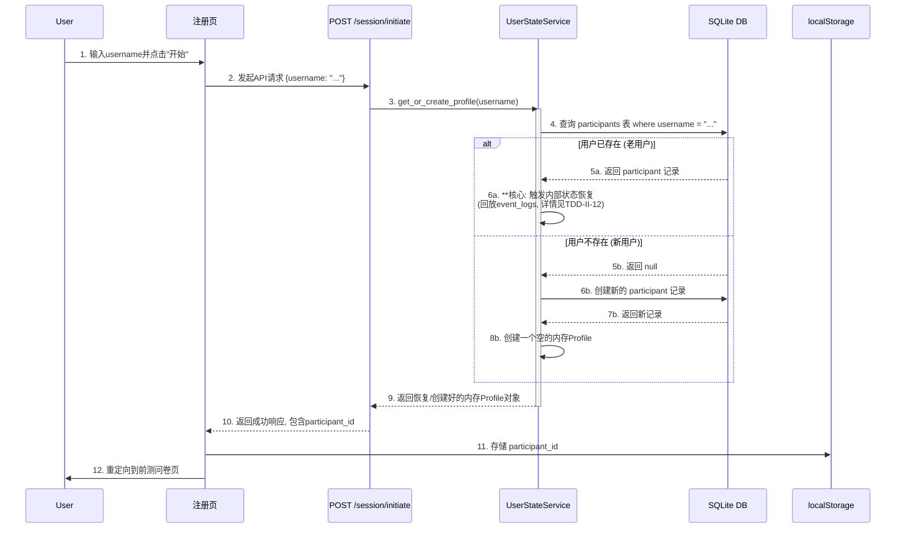

### **技术设计文档 (TDD-II-02): 用户注册与会话启动**

**版本:** 1.3
**关联的顶层TDD:** V1.2 - 章节 3.1 (数据库设计), 3.2 (API接口规范)
**作者:** 曹欣卓
**日期:** 2025-7-28
**修订人:** 
**修订日期:** 2025-8-3

#### **1. 功能概述 (Feature Overview)**

**目标:** 为新参与者提供一个简单、直观的会话启动入口，并为返回的参与者提供无缝的会话恢复机制。用户通过提供一个系统生成的`participant_id`来创建或恢复他们的实验会话。系统将使用此ID进行后续所有的数据追踪和状态管理。

**核心原则:**
*   **无状态后端 (Stateless Backend):** 后端不通过Cookie或服务器端Session来维护用户状态。用户的身份完全由前端在每次请求中提供的`participant_id`决定。
*   **持久化前端会话 (Persistent Frontend Session):** `participant_id` 在首次获取后，必须被安全地存储在客户端（`localStorage`），以支持浏览器刷新或关闭后的会话恢复。
*   **幂等操作 (Idempotent Operation):** 多次使用相同的`participant_id`启动会话，应返回相同的结果，而不会重复创建用户。

**范围:**
1.  设计`POST /api/v1/session/initiate`端点的详细前后端逻辑。
2.  规范前端如何使用`localStorage`进行会话持久化。
3.  确保所有后续的API请求都能方便地获取并携带`participant_id`。

#### **2. 设计与实现**

##### **2.1. 会话启动时序图 (Sequence Diagram)**



##### **2.2. 后端实现 (FastAPI)**

###### 数据模型定义
*   **API端点:** `POST /api/v1/session/initiate`
*   **Pydantic Schemas (`backend/app/schemas/session.py`):**
```python
# backend/app/schemas/session.py
from pydantic import BaseModel, Field

class SessionInitiateRequest(BaseModel):
    """会话初始化请求模型
    
    用于初始化用户会话，包含参与者ID和分组信息。
    
    Attributes:
        participant_id: 参与者唯一标识符（UUID格式）
        group: 实验分组，默认为'experimental'实验组
    """
    participant_id: str = Field(..., description="System-generated unique ID (UUID) for the participant")
    group: str = Field("experimental", description="Assigned experiment group")

class SessionInitiateResponse(BaseModel):
    """会话初始化响应模型
    
    返回会话初始化结果，包含参与者ID和新用户状态。
    
    Attributes:
        participant_id: 参与者唯一标识符（UUID格式）
        is_new_user: 是否为新用户，用于判断是否需要显示引导内容
    """
    participant_id: str = Field(..., description="System-generated unique ID (UUID) for the participant")
    is_new_user: bool
```
这部分代码使用了 [Pydantic](https://www.google.com/search?q=https://docs.pydantic.dev/) 库来定义数据模型（Schemas）。在 FastAPI 应用中，Pydantic主要有三大作用：
1. **数据校验 (Data Validation):** 自动检查传入的请求数据是否符合预定义的格式、类型和约束（比如长度限制）。如果数据不合法，FastAPI 会自动返回一个清晰的错误信息。
2. **数据序列化 (Data Serialization):** 定义从后端发送到前端的响应数据的结构，确保只返回定义好的字段。
3. **API文档生成 (API Documentation):** FastAPI 会根据这些模型自动生成交互式的 API 文档（如 Swagger UI），让前后端开发者都能清楚地知道接口需要什么数据、返回什么数据。
简单来说，Pydantic 模型就像是前后端之间签订的**数据协议**，规定了数据交换的格式和规则。

`SessionInitiateRequest(BaseModel)`这个类定义了 `POST /api/v1/session/initiate` 端点 **期望接收的请求体 (Request Body) 的格式**。当前端调用这个API时，发送的 JSON 数据必须符合这个结构。
- **`participant_id: str = Field(..., ...)`**
    - `participant_id: str`: 定义了一个名为 `participant_id` 的字段，它的类型必须是字符串 (`str`)。
    - `Field(...)`: 这是 Pydantic 提供的一个功能，允许你为字段添加额外的配置和元数据。
    - 第一个参数 `...` (Ellipsis): 表示这个字段是**必需的 (required)**。前端在请求中必须提供 `participant_id` 字段，否则会报错。
    - `description="..."`: 为这个字段提供了一段描述，这段描述会显示在自动生成的API文档中，非常有用。
- **`group: str = Field("experimental", ...)`**
    - `group: str`: 定义了一个名为 `group` 的字段，类型为字符串。
    - 第一个参数 `"experimental"`: 这为该字段设置了**默认值 (default value)**。如果前端的请求中没有包含 `group` 字段，后端会自动使用 `"experimental"` 作为它的值。
    - `description="..."`: 同样是为API文档提供的描述。

`SessionInitiateResponse(BaseModel)`这个类定义了 `POST /api/v1/session/initiate` 端点 **成功时返回的响应体中 `data` 部分的格式**。它向前端承诺，返回的 JSON 数据会包含以下字段。
- **`participant_id: str = Field(..., ...)`**
    - 定义了响应中必须包含一个名为 `participant_id` 的字符串字段。这就是系统为每个用户生成的、独一无二的 UUID，是后续所有操作的身份凭证。
    - `...` 同样表示这个字段是必需的。
- **`is_new_user: bool`**
    - 响应中会包含一个布尔值 (`true` 或 `false`)。
    - `true` 表示该参与者是首次使用系统，系统为他创建了一个新的参与者记录。
    - `false` 表示该参与者已存在，系统找到了之前的记录，实现了会话恢复。

这部分代码是整个API设计的基石。

---
###### 推荐实现方案
**注意：根据系统架构设计，推荐使用UserStateService方案来处理会话启动，因为它能更好地处理用户状态恢复的复杂性。**

**后端端点逻辑 (`backend/app/api/endpoints/session.py`):**
在处理请求时，我们通过`UserStateService`来获取或创建用户，这个过程隐式地包含了状态恢复。
```python
# backend/app/api/endpoints/session.py
from fastapi import APIRouter, Depends, HTTPException, status, Response
from sqlalchemy.orm import Session
from app.db.session import get_db
from app.services.user_state_service import user_state_service
from app.schemas.session import SessionInitiateRequest, SessionInitiateResponse
from app.schemas.response import StandardResponse

router = APIRouter()

@router.post("/initiate", response_model=StandardResponse[SessionInitiateResponse])
def initiate_session(
    response: Response,
    session_in: SessionInitiateRequest,
    db: Session = Depends(get_db)
):
    try:
        # 调用 get_or_create_profile
        # 这个方法会处理新用户创建和老用户状态恢复的所有复杂性
        profile = user_state_service.get_or_create_profile(session_in.username, db)
        
        # 检查这是否是一个真正的新用户
        # 注意：需要UserStateService返回is_new标志，或者通过其他方式判断
        # 假设profile有一个is_new_user属性，或者通过其他方式获取
        is_new_user = getattr(profile, 'is_new_user', False)
        
        # 构建响应数据
        response_data = SessionInitiateResponse(
            participant_id=profile.participant_id,
            username=profile.username,
            is_new_user=is_new_user
        )
        
        # 设置HTTP状态码以符合RESTful风格
        if is_new_user:
            response.status_code = status.HTTP_201_CREATED
        
        # 返回标准成功响应
        return StandardResponse(
            data=response_data
        )
        
    except Exception as e:
        # 记录错误日志（在实际项目中应该使用logging模块）
        print(f"Error initiating session: {str(e)}")
        # 返回标准错误响应
        raise HTTPException(
            status_code=status.HTTP_500_INTERNAL_SERVER_ERROR,
            detail={"code": 500, "message": "Failed to initiate session"}
        )
```

**实现要点说明：**
- **使用UserStateService**: 通过`user_state_service.get_or_create_profile`方法处理用户创建和状态恢复
- **HTTP状态码**: 新用户返回201状态码，老用户返回200状态码
- **错误处理**: 使用标准的HTTPException处理错误情况
- **依赖注入**: 正确使用FastAPI的依赖注入系统获取数据库会话

---
###### UserStateService增强建议
为了让`get_or_create_profile`方法能够返回`is_new_user`标志，建议对UserStateService进行如下增强：

```python
# backend/app/services/user_state_service.py 中的增强版本
def get_or_create_profile(self, username: str, db: Session) -> (StudentProfile, bool):
    """
    获取或创建用户配置
    
    Returns:
        tuple: (profile, is_new_user)
    """
    # 检查用户是否已存在
    from ..crud.crud_participant import get_by_username, create
    from ..schemas.session import SessionInitiateRequest
    
    participant = get_by_username(db, username=username)
    is_new_user = False
    
    if not participant:
        # 创建新用户
        session_request = SessionInitiateRequest(username=username)
        participant = create(db, obj_in=session_request)
        is_new_user = True
    
    # 获取或创建内存Profile
    if participant.id not in self._state_cache:
        print(f"INFO: Cache miss for {participant.id}. Attempting recovery from history.")
        self._recover_from_history_with_snapshot(participant.id, db)

    # 如果恢复后仍然没有（说明是全新用户），则创建一个空的
    if participant.id not in self._state_cache:
        self._state_cache[participant.id] = StudentProfile(participant.id)
        
    # 为Profile添加is_new_user属性
    profile = self._state_cache[participant.id]
    profile.is_new_user = is_new_user
    profile.username = participant.username
    
    return profile, is_new_user
```

---
###### 替代实现方案（不推荐）
为了完整性，下面提供直接使用CRUD的实现方案，但在本系统中**不推荐使用**：

```python
# backend/app/api/endpoints/session.py (替代方案，不推荐)
from fastapi import APIRouter, Depends, HTTPException, status, Response
from sqlalchemy.orm import Session
from app.db.session import get_db
from app.schemas.response import StandardResponse
from app.schemas.session import SessionInitiateRequest, SessionInitiateResponse
from app.crud import crud_participant

router = APIRouter()

@router.post("/initiate", response_model=StandardResponse[SessionInitiateResponse])
def initiate_session(
	response: Response,
	session_in: SessionInitiateRequest,
	db: Session = Depends(get_db)
):
	participant = crud_participant.get_by_username(db, username=session_in.username)
	is_new = False
  
	if not participant:
		participant = crud_participant.create(db, obj_in=session_in)
		is_new = True
		response.status_code = status.HTTP_201_CREATED # 符合RESTful风格
  
	response_data = SessionInitiateResponse(
		participant_id=participant.id,
		username=participant.username,
		is_new_user=is_new
	)
	return StandardResponse(data=response_data)
```

这个方案虽然简单直接，但无法处理复杂的状态恢复需求。

---
##### **2.3. 前端实现 (JavaScript)**

*   **会话管理模块 (`frontend/js/modules/session.js`):**
```javascript
// frontend/js/modules/session.js
const PARTICIPANT_ID_KEY = 'participant_id';

export function saveParticipantId(id) {
  localStorage.setItem(PARTICIPANT_ID_KEY, id);
}

export function getParticipantId() {
  return localStorage.getItem(PARTICIPANT_ID_KEY);
}

export function clearParticipantId() {
  localStorage.removeItem(PARTICIPANT_ID_KEY);
}

// 在页面加载时检查，如果已有会话，可以直接跳转，避免重复注册
export function checkAndRedirect() {
  if (getParticipantId()) {
	// 如果当前不是知识图谱页，则跳转过去
	if (!window.location.pathname.includes('knowledge_graph.html')) {
	   window.location.href = '/knowledge_graph.html';
	}
  }
}
```
这个文件是一个**可复用的工具模块**，专门负责处理与浏览器会话相关的所有操作。它的核心是利用了浏览器的 `localStorage` 技术。
- **`localStorage` 是什么?** `localStorage` 是浏览器提供的一种本地存储机制。与 `cookie` 不同，它存储的数据**没有过期时间**，除非被用户手动清除或代码主动删除。即使用户关闭浏览器或重启电脑，`localStorage` 中的数据依然存在。这正是实现持久化会话的关键。
- **各个函数的作用:**
    - `saveParticipantId(id)`: 调用 `localStorage.setItem` 方法，将后端返回的 `participant_id` 以键值对的形式 (`'participant_id': 'some-uuid-string'`) 存入 `localStorage`。
    - `getParticipantId()`: 调用 `localStorage.getItem` 方法，根据键名 `'participant_id'` 从 `localStorage` 中读取出已保存的用户ID。
    - `clearParticipantId()`: 调用 `localStorage.removeItem` 方法，删除已保存的用户ID。这个函数在用户登出时会很有用。
    - `checkAndRedirect()`: 这是一个提升用户体验的核心函数。
        - 它首先检查 `localStorage` 中是否存在 `participant_id`。
        - 如果**存在**，说明用户之前已经登录过，是个"返回用户"。为了避免让用户重复输入用户名，它会检查当前页面的URL。如果用户不在主功能页（如 `knowledge_graph.html`），代码会自动将他**重定向**过去，实现无缝的会话恢复。

---
*   **注册页面逻辑 (`frontend/js/pages/registration.js`):**
```javascript
// frontend/js/pages/registration.js
import { saveParticipantId, checkAndRedirect } from '../modules/session.js';

// 页面加载时先检查是否已有会话
checkAndRedirect();

const startButton = document.getElementById('start-button');
const usernameInput = document.getElementById('username-input');

startButton.addEventListener('click', async () => {
  // ... (按钮禁用、输入校验等UI逻辑) ...

  const response = await fetch('/api/v1/session/initiate', { /* ... */ });
  const result = await response.json();

  if (result.code === 200 || result.code === 201) {
	saveParticipantId(result.data.participant_id);
	// 注册成功后，跳转到"前测问卷"页面，这是科研流程的一部分
	window.location.href = `/survey.html?type=pre-test`;
  } else {
	// ... (显示错误信息) ...
  }
});
```
这个文件是**注册/登录页（`index.html`）的专属脚本**，负责处理该页面的所有交互逻辑。
- **`checkAndRedirect();`**
    - 这是这个脚本执行的第一行代码。它首先调用了上面模块中的 `checkAndRedirect` 函数。这意味着，当一个已经登录过的用户试图访问注册页时，他甚至看不到注册表单，就会被立刻重定向到主功能页。
- **`startButton.addEventListener('click', async () => { ... });`**
    - 这部分代码为 "开始" 按钮绑定了一个点击事件监听器。当用户输入用户名并点击按钮后，会执行以下异步 (`async`) 流程：
        1. **API 请求:** 使用 `fetch` 函数向后端 `/api/v1/session/initiate` 端点发起一个 POST 请求。（代码中省略了请求体的具体构造，但它会包含用户输入的 `username`）。
        2. **处理响应:** `await response.json()` 等待并解析后端返回的 JSON 数据。
        3. **成功逻辑:**
            - 检查返回结果的 `code` 是否为 `200` (成功找到老用户) 或 `201` (成功创建新用户)。
            - 如果成功，立即调用 `saveParticipantId()` 将后端返回的 `participant_id` 保存到 `localStorage` 中。
            - **页面跳转:** `window.location.href = ...` 将页面重定向到实验流程的下一步（这里是"前测问卷"页），而不是直接到知识图谱页，这表明注册是一个完整流程的入口。
        4. **失败逻辑:** 如果API返回错误，则可以在 `else` 块中向用户显示错误提示。

---
*   **API客户端封装 (`frontend/js/api_client.js`):** (推荐)
    为了避免在每个`fetch`调用中都重复获取`participant_id`，可以将其封装。
```javascript
// frontend/js/api_client.js
import { getParticipantId } from './modules/session.js';

async function post(endpoint, body) {
  const participantId = getParticipantId();
  if (!participantId) {
	// 如果没有ID，说明会话已丢失，应强制返回注册页
	window.location.href = '/index.html';
	throw new Error("Session not found. Redirecting to login.");
  }

  // 自动在请求体中注入participant_id
  const fullBody = { ...body, participant_id: participantId };

  const response = await fetch(`/api/v1${endpoint}`, {
	  method: 'POST',
	  headers: { 'Content-Type': 'application/json' },
	  body: JSON.stringify(fullBody),
  });
  return response.json();
}
// ... 实现 get, put, delete 等方法
```
这是一个**强烈推荐的最佳实践**。它将 `fetch` 调用封装成一个更易于使用的客户端模块，主要目的是**简化后续所有需要身份验证的 API 调用**。
- **为什么需要封装?** 在用户登录后，几乎所有后续的API请求（如获取数据、保存进度等）都需要携带 `participant_id` 来表明身份。如果没有这个封装，你就需要在每一个 `fetch` 调用前都手动写一遍 `getParticipantId()`，非常繁琐且容易出错。
- **`post(endpoint, body)` 函数的逻辑:**
    1. **会话检查:** 在发起任何请求之前，它先调用 `getParticipantId()` 检查本地是否存在会话ID。
    2. **强制重定向:** 如果 `participantId` 不存在（可能因为用户清除了缓存或会话已过期），这是一个**关键的保护机制**。它会立即停止API调用，并强制将页面重定向回登录页 (`/index.html`)，防止应用在无身份状态下运行而出错。
    3. **自动注入ID:** 如果ID存在，它会使用展开语法 `...body` 自动将 `participant_id` 添加到请求体 `fullBody` 中。调用这个函数的代码再也无需关心 `participant_id` 是如何被添加的。
    4. **执行请求:** 最后，它像一个标准的 `fetch` 调用一样，构造并发送请求。

---
**总结:**
设计了一个健壮、符合RESTful风格的用户注册与会话启动流程。通过将`participant_id`的状态完全交由前端`localStorage`管理，我们实现了持久化会话，同时保持了后端的无状态性，使其更易于开发和扩展。自动将会话检查和ID注入封装到模块中，提高了代码的复用性和健壮性。这个机制是连接用户所有后续行为数据的关键纽带。