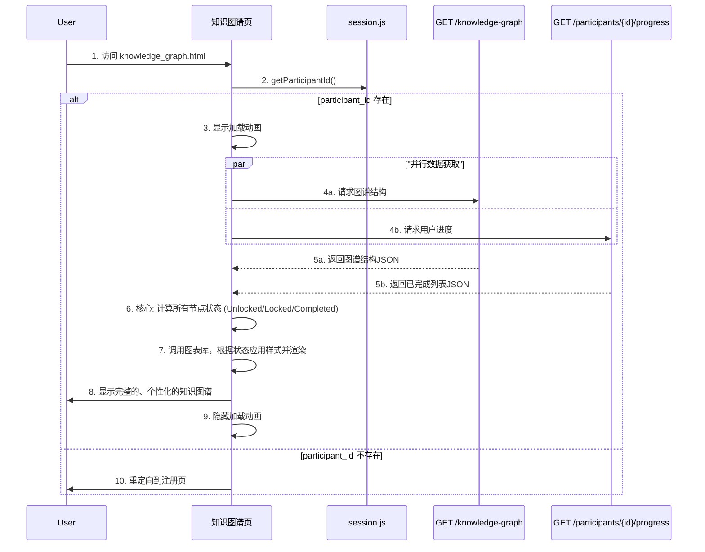

### **技术设计文档 (TDD-II-03): 知识图谱系统**

**版本:** 1.2
**关联的顶层TDD:** V1.2 - 章节 3.1 (数据库设计), 3.2 (API接口规范)
**作者:** 曹欣卓
**日期:** 2025-7-28

#### **1. 功能概述 (Feature Overview)**

**目标:** 为学习者提供一个可视化的、交互式的课程学习地图。该页面需要清晰地展示整个课程的知识点结构，并根据用户的学习进度动态地计算和展示每个知识点节点的状态：“已完成 (Completed)”、“已解锁/待学习 (Unlocked)”或“已锁定 (Locked)”，从而为用户提供清晰的学习路径指引。

**核心原则:**
*   **数据驱动视图 (Data-Driven View):** 页面的渲染完全基于从后端获取的“图谱结构”和“用户进度”两份数据。
*   **高效加载:** 采用并行API请求策略，同时获取图谱结构和用户进度，最大限度地减少页面加载等待时间。
*   **前端状态计算:** 节点状态（Completed, Unlocked, Locked）的计算逻辑在前端完成，减轻服务器负担，并能即时响应。

**范围:**
1.  设计 `GET /api/v1/knowledge-graph` (静态结构) 和 `GET /api/v1/participants/{id}/progress` (动态进度) 两个API。
2.  设计前端的状态计算引擎，用于在渲染前确定每个节点的状态。
3.  定义不同节点状态的视觉表现和交互行为。

#### **2. 设计与实现**

##### **2.1. 知识图谱加载时序图 (Sequence Diagram)**



##### **2.2. 后端实现 (FastAPI)**

*   **API 1: 获取知识图谱结构**
    *   **Endpoint:** `GET /api/v1/knowledge-graph`
    *   **实现:** 从静态JSON文件 (`backend/data/knowledge_graph.json`) 读取并返回数据。文件内容应包含`nodes`和`edges`。`edges`中的 `{ "source": "A", "target": "B" }` 表示 A 是 B 的前置依赖。
	```python
	# backend/app/api/endpoints/knowledge_graph.py
	# ... (实现与TDD-05类似，使用内存缓存优化) ...
	@router.get("/knowledge-graph", response_model=StandardResponse[KnowledgeGraph])
	def get_knowledge_graph():
		# ...
	```
- **作用:** 提供通用的、静态的课程结构。
- **实现:** 这个接口的逻辑非常简单，它直接从服务器上的一个静态JSON文件 (`knowledge_graph.json`) 读取数据并返回。这个文件定义了所有的 `nodes` (知识点) 和 `edges` (依赖关系)。比如 `{ "source": "A", "target": "B" }` 就表示知识点A是知识点B的前置条件。
- **优化:** 注释中提到“使用内存缓存优化”，意味着为了避免每次请求都去读硬盘文件，服务器启动时可以先把这个JSON文件的内容加载到内存里，后续请求直接从内存读取，速度会快非常多。

---

*   **API 2: 获取用户学习进度**
    *   **Endpoint:** `GET /api/v1/participants/{participant_id}/progress`
    *   **实现:** 查询 `user_progress` 表，返回指定`participant_id`的所有`topic_id`。
	```python
	# backend/app/crud/crud_progress.py
	def get_completed_topics_by_user(db: Session, *, participant_id: str) -> List[str]:
		results = db.query(UserProgress.topic_id).filter(UserProgress.participant_id == participant_id).all()
		return [row[0] for row in results]
	
	# backend/app/api/endpoints/progress.py
	@router.get("/participants/{participant_id}/progress", response_model=StandardResponse[UserProgressResponse])
	def get_user_progress(participant_id: str, db: Session = Depends(get_db)):
		completed_topics = crud_progress.get_completed_topics_by_user(db, participant_id=participant_id)
		return StandardResponse(data={"completed_topics": completed_topics})
	```
- **作用:** 提供特定用户的学习进度。
- **实现:** 这个接口与数据库交互。
    1. `get_completed_topics_by_user` 函数负责查询数据库。
    2. 它在 `UserProgress` 表中，根据URL中传过来的 `participant_id`进行过滤。
    3. 查询结果只提取 `topic_id` 这一列，并把所有结果汇集成一个列表，例如 `["基础语法", "数据类型", "循环控制"]`。
    4. `get_user_progress` 接口函数调用上面的查询函数，并将返回的列表包装成标准的响应格式再发给前端。

---

##### **2.3. 前端实现 (JavaScript)**

*   **页面加载与数据获取 (`frontend/js/pages/knowledge_graph.js`):**
```javascript
// frontend/js/pages/knowledge_graph.js
import { getParticipantId } from '../modules/session.js';
import { renderGraph, setupGraphInteractions } from '../modules/graph_renderer.js';
import { processGraphData } from '../modules/graph_logic.js';

document.addEventListener('DOMContentLoaded', async () => {
  const participantId = getParticipantId();
  if (!participantId) { window.location.href = '/index.html'; return; }

  // ... (显示加载动画) ...

  const [graphResponse, progressResponse] = await Promise.all([
	fetch('/api/v1/knowledge-graph'),
	fetch(`/api/v1/participants/${participantId}/progress`)
  ]);
  // ... (错误处理) ...
  const graphResult = await graphResponse.json();
  const progressResult = await progressResponse.json();

  const graphData = graphResult.data;
  const completedTopics = new Set(progressResult.data.completed_topics);

  // 调用状态计算引擎
  const { processedNodes, dependencies } = processGraphData(graphData, completedTopics);

  // 渲染并设置交互
  const graphInstance = renderGraph(processedNodes, graphData.edges);
  setupGraphInteractions(graphInstance, dependencies, completedTopics);

  // ... (隐藏加载动画) ...
});
```
这个文件是整个知识图谱页面的**主入口和协调器**。当用户访问这个页面时，它的代码最先被执行，负责把所有事情串联起来。
**代码解读:**
- `import ...`: 从其他JS文件中导入专门的函数：
    - `getParticipantId` 负责用户身份。
    - `renderGraph`, `setupGraphInteractions` 负责画图和交互。
    - `processGraphData` 负责核心的逻辑计算。
- `document.addEventListener('DOMContentLoaded', ...)`: 确保在整个HTML页面加载完成后再执行JS代码，避免操作不存在的页面元素。
- `const participantId = getParticipantId();`: 首先检查用户是否登录。如果未登录 (`!participantId`)，就直接跳转到首页，后续代码不再执行。
- `const [graphResponse, progressResponse] = await Promise.all([...])`: 这是前端实现**并行请求**的关键代码。`Promise.all`会同时发出两个`fetch`网络请求，然后等待两个请求都成功返回。这比一个一个请求能节省大量时间。
- `const graphData = graphResult.data;`: 从第一个API响应中解析出图谱的结构数据（节点、边）。
- `const completedTopics = new Set(progressResult.data.completed_topics);`: 从第二个API响应中解析出用户已完成的课程列表。这里使用了 `new Set()`，它将数组转换成一个**Set数据结构**。使用Set来存储已完成的课程ID，是因为**查询一个元素是否存在于Set中 (`.has()`) 的效率远高于在数组中查询 (`.includes()`)**，这是一个性能优化。
- `const { processedNodes, dependencies } = processGraphData(...)`: 调用“状态计算引擎”，将原始的图谱数据和用户进度传进去，获取带有状态标记的节点列表。
- `renderGraph(...)` 和 `setupGraphInteractions(...)`: 最后，调用“渲染器”模块，先根据计算好的状态将图谱画出来，然后为图谱上的节点设置点击等交互事件。

---

*   **状态计算引擎 (`frontend/js/modules/graph_logic.js`):**
    这是一个纯逻辑模块，负责计算状态，不涉及DOM操作。
```javascript
// frontend/js/modules/graph_logic.js
export const NODE_STATUS = {
	COMPLETED: 'completed',
	UNLOCKED: 'unlocked',
	LOCKED: 'locked'
};

export function processGraphData(graphData, completedTopics) {
	const dependencies = {}; // 邻接表，key是topic，value是其前置依赖数组
	graphData.edges.forEach(edge => {
		if (!dependencies[edge.target]) dependencies[edge.target] = [];
		dependencies[edge.target].push(edge.source);
	});

	const processedNodes = graphData.nodes.map(node => {
		const status = _calculateNodeStatus(node.id, completedTopics, dependencies);
		return { ...node, status };
	});

	return { processedNodes, dependencies };
}

function _calculateNodeStatus(nodeId, completedTopics, dependencies) {
	if (completedTopics.has(nodeId)) return NODE_STATUS.COMPLETED;
  
	const prereqs = dependencies[nodeId] || [];
	if (prereqs.every(prereqId => completedTopics.has(prereqId))) {
		return NODE_STATUS.UNLOCKED;
	}
  
	return NODE_STATUS.LOCKED;
}
```
这个文件是思维导图模块的核心。它是一个纯粹的逻辑模块，不执行任何页面操作，只负责接收数据、计算，然后返回结果。这种设计让它非常容易进行测试和维护。
代码解读:
- `export const NODE_STATUS = {...}`: 定义了三个常量来表示节点状态。这样做可以避免在代码中直接写字符串（如`'completed'`），减少因拼写错误导致的bug。
- `export function processGraphData(...)`: 这是该模块的主函数。
    1. **创建`dependencies`对象**: 它的第一步是遍历 `graphData.edges`（所有的依赖关系），创建一个名为 `dependencies` 的“邻接表”。这个表可以让我们非常快速地查到一个节点的所有前置依赖。例如，如果A和C都是B的前置，这个对象就会是 `{ "B": ["A", "C"] }`
    2. **遍历所有节点**: 使用 `.map()` 方法遍历 `graphData.nodes` 数组中的每一个节点。
    3. **计算状态**: 对每一个节点，调用内部的 `_calculateNodeStatus` 函数来确定它的状态。
    4. **返回新节点数据**: `.map()` 会返回一个**新的**节点数组 (`processedNodes`)，其中每个节点对象都包含了原始信息（通过 `...node` 展开）以及一个新增的 `status` 属性。
- `function _calculateNodeStatus(...)`: 这是核心算法的实现。
    1. `if (completedTopics.has(nodeId)) ...`: **第一优先级判断**：这个节点在不在“已完成”的Set里？如果在，直接返回 `COMPLETED`。
    2. `const prereqs = dependencies[nodeId] || [];`: 从之前创建的 `dependencies` 表中查找当前节点的所有前置依赖。如果一个节点没有前置依赖（比如是课程的起点），`prereqs` 就是一个空数组。
    3. `if (prereqs.every(prereqId => completedTopics.has(prereqId))) ...`: **第二优先级判断**：使用数组的 `.every()` 方法，检查 `prereqs` 数组中的**每一个**依赖 (`prereqId`) 是否都在 `completedTopics` 这个Set里。
        - 如果所有前置依赖都完成了（或者`prereqs`为空数组），`.every()` 会返回 `true`，那么该节点的状态就是 `UNLOCKED`。
    4. `return NODE_STATUS.LOCKED;`: **最后的情况**：如果一个节点既没有完成，又不满足解锁条件，那它必然是 `LOCKED` 状态。

没必要使用Dijkstra了

---


*   **图谱渲染与交互 (`frontend/js/modules/graph_renderer.js`):**
```javascript
// frontend/js/modules/graph_renderer.js
import { NODE_STATUS } from './graph_logic.js';

export function renderGraph(nodes, edges) {
  // ... (初始化图表库, e.g., G6) ...
  nodes.forEach(node => {
	// 根据 node.status 应用不同的样式
	node.style = _getStyleForStatus(node.status);
  });
  graph.data({ nodes, edges });
  graph.render();
  return graph; // 返回图表实例
}

export function setupGraphInteractions(graphInstance, dependencies, completedTopics) {
  graphInstance.on('node:click', evt => {
	const { id, status } = evt.item.getModel();
	// 根据 status 执行不同的弹窗和跳转逻辑
	// ...
  });
}

function _getStyleForStatus(status) { /* ... 返回不同状态的样式对象 ... */ }
```
这个文件是控制前端界面的。它负责将逻辑处理好的数据转化为用户能看到的视觉图形，并响应用户的操作。
**代码解读:**
- `export function renderGraph(nodes, edges)`:
    - 它会使用一个第三方图表库（可以用学长上次提到的那个库，或者我这里说的G6）。
    - 遍历 `nodes` 数组，并根据每个节点的 `node.status` 属性，调用 `_getStyleForStatus` 函数来获取对应的样式（如颜色、边框、大小等）。
    - 最后调用图表库的API (`graph.data()` 和 `graph.render()`)，将带有样式信息的节点和边数据渲染在页面上。
    - 返回图表库的实例 `graph`，方便后续函数（如交互函数）操作它。
- `export function setupGraphInteractions(...)`:
    - 它接收 `renderGraph` 返回的图表实例。
    - `graphInstance.on('node:click', ...)`: 为图谱上的所有节点绑定一个点击事件监听器。
    - 当用户点击某个节点时，事件回调函数会执行，并从事件对象 `evt` 中拿到被点击节点的模型数据，包括它的 `id` 和 `status`。
    - 接下来就可以根据 `status` 实现不同的交互逻辑了。例如：
        - 如果点击的是 `UNLOCKED` 节点，可以弹窗并提供课程学习的链接。
        - 如果点击的是 `LOCKED` 节点，可以提示用户需要先完成哪些前置课程。

---

**总结:**
`knowledge_graph.js` 负责流程控制，`graph_logic.js` 负责数据处理，`graph_renderer.js` 负责视觉呈现。通过将**静态图谱结构**和**动态用户进度**分离到两个独立的API，我们实现了高效的数据加载。核心的**状态计算逻辑**被明确地放在前端，使其能够快速响应并减轻后端压力。通过模块化的JS代码组织，我们将数据处理、渲染和交互逻辑清晰地分离开来，使得整个系统易于理解、开发和维护。