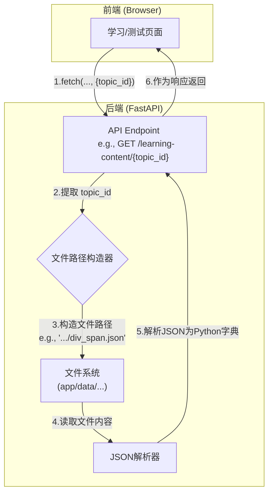
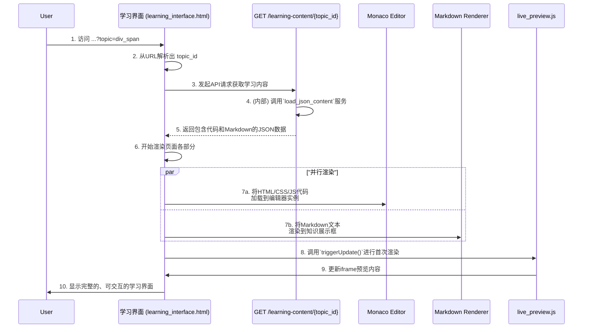

### **技术设计文档 (TDD-II-04): 学习与测试内容服务**

**版本:** 1.2
**关联的顶层TDD:** V1.2 - 章节 3.2 (API接口规范)
**作者:** 曹欣卓
**日期:** 2025-7-28

#### **1. 功能概述 (Feature Overview)**

**目标:** 设计并实现一套API服务，用于按需提供特定知识点（Topic）的学习材料和测试任务。该服务是内容驱动页面的基础，确保学习和测试界面能够动态加载与其上下文相关的内容。

**核心原则:**

* **内容与逻辑分离:** 学习和测试的具体内容（文字、代码、检查点）应作为“数据”进行管理，与提供这些数据的后端“逻辑”完全分离。
* **结构化内容:** 所有内容都应以结构化的JSON格式进行定义和存储，方便后端解析和前端渲染。
* **可扩展性:** 内容管理方式应易于维护和扩展，方便未来增删或修改知识点，而无需改动后端代码。

**范围:**

1. 设计`GET /api/v1/learning-content/{topic_id}` API的详细实现。
2. 设计`GET /api/v1/test-tasks/{topic_id}` API的详细实现。
3. 定义和管理存储这些内容的静态JSON文件结构。

#### **2. 设计与实现**

##### **2.1. 内容存储结构**

为了实现内容与逻辑分离，我们将所有学习和测试材料存储在后端的静态文件中。

* **目录结构:**
  ```
  backend/
  └── app/
      └── data/
          ├── learning_content/
          │   ├── html_intro.json
          │   ├── div_span.json
          │   └── ...
          └── test_tasks/
              ├── html_intro.json
              ├── div_span.json
              └── ...
  ```
* **学习内容文件结构 (`learning_content/{topic_id}.json`):**
  ```json
  {
    "topic_id": "div_span",
    "title": "div 和 span 标签",
    "code": {
      "html": "<body>\n  <div id='container'>\n    <p>这是一个段落。</p>\n    <span>这是一个行内元素。</span>\n  </div>\n</body>",
      "css": "#container {\n  border: 1px solid black;\n}",
      "js": ""
    },
    "documentation_md": "# `<div>` 标签\n`<div>` 是一个通用的块级容器..."
  }
  ```
* **测试任务文件结构 (`test_tasks/{topic_id}.json`):**
这是个示例
  ```json
{
  "topic_id": "js_simple_counter",
  "description_md": "请实现一个简单的计数器。点击'增加'按钮时，ID为`counter-display`的元素的文本内容应该增加1。",
  "start_code": {
    "html": "<body>\n  <p id='counter-display'>Count: 0</p>\n  <button id='add-btn'>增加</button>\n</body>",
    "css": "/* 你可以添加一些样式 */",
    "js": "// 在这里编写你的JavaScript逻辑"
  },
  "checkpoints": [
    {
      "name": "初始状态检查",
      "type": "assert_text_content",
      "selector": "#counter-display",
      "assertion_type": "contains",
      "value": "Count: 0",
      "feedback": "页面加载时，计数器的初始值应为 'Count: 0'。"
    },
    {
      "name": "第一次点击后检查",
      "type": "interaction_and_assert",
      "action_selector": "#add-btn",
      "action_type": "click",
      "assertion": {
        "type": "assert_text_content",
        "selector": "#counter-display",
        "assertion_type": "contains",
        "value": "Count: 1",
        "feedback": "点击'增加'按钮一次后，计数器没有正确地显示 'Count: 1'。"
      }
    },
    {
      "name": "第二次点击后检查",
      "type": "interaction_and_assert",
      "action_selector": "#add-btn",
      "action_type": "click",
      "assertion": {
        "type": "assert_text_content",
        "selector": "#counter-display",
        "assertion_type": "contains",
        "value": "Count: 2",
        "feedback": "连续点击'增加'按钮两次后，计数器没有正确地显示 'Count: 2'。"
      }
    },
    {
      "name": "按钮样式检查 (可选)",
      "type": "assert_style",
      "selector": "#add-btn",
      "css_property": "cursor",
      "assertion_type": "equals",
      "value": "pointer",
      "feedback": "为了更好的用户体验，按钮的鼠标悬停样式应该是'pointer'。"
    }
  ]
}

  ```
1. **引入 `name` 字段:** 为每个检查点增加一个可读的名称，这在返回给用户的失败反馈中非常有用，可以告诉用户是哪一步检查失败了，例如：“_测试失败：在'第一次点击后检查'步骤中，计数器没有正确地显示 'Count: 1'。_”
2. **完全采用新断言类型:**
    - `assert_text_content` 使用 `contains`，允许用户写 `Count: 0` 或 `Current Count: 0` 等，只要包含关键部分即可（当然也可以用`equals`或`matches_regex`来强制精确匹配）。
    - **`interaction_and_assert`** 成为了测试动态功能的核心。它清晰地描述了“做什么动作（action）” -> “产生什么结果（assertion）”。
3. **支持多步测试:** 像上面的例子，通过多个`interaction_and_assert`检查点，我们可以模拟一个完整的用户交互序列（初始化 -> 点击1次 -> 点击2次），这对于测试有状态的组件至关重要。
4. **灵活性:** 我们可以混合使用不同类型的检查点，既测试功能，也测试一些关键的样式或属性，提供了非常高的灵活性。

##### **2.2. 内容服务流程图与时序图**





##### **2.3. 后端实现 (FastAPI)**

我们将创建一个通用的内容服务，以避免代码重复。

* **Pydantic Schemas (`backend/app/schemas/content.py`):**
  ```python
  # backend/app/schemas/content.py
  # ... 定义 LearningContent, TestTask 等响应模型 ...
  ```
* **通用内容加载服务 (`backend/app/services/content_loader.py`):**
```python
# backend/app/services/content_loader.py (new file)
import json
from pathlib import Path
from fastapi import HTTPException
from functools import lru_cache

# 获取data目录的绝对路径
DATA_DIR = Path(__file__).parent.parent / "data"

# 使用LRU缓存来避免重复读取文件，提升性能
@lru_cache(maxsize=128)
def load_json_content(content_type: str, topic_id: str) -> dict:
  """
  一个带缓存的函数，用于从JSON文件中加载内容。 
  content_type 应该是 'learning_content' 或 'test_tasks'。
  """
  content_file = DATA_DIR / content_type / f"{topic_id}.json"
  if not content_file.exists():
	  raise HTTPException(status_code=404, detail=f"{content_type} for topic '{topic_id}' not found.")

  with open(content_file, "r", encoding="utf-8") as f:
	  return json.load(f)
```
- **路径管理 (`DATA_DIR`)**: `DATA_DIR = Path(__file__).parent.parent / "data"`
    - 这行代码使用 `pathlib` 模块来构造一个指向 `data` 目录的绝对路径。`__file__` 代表当前文件 (`content_loader.py`) 的路径，`.parent.parent` 向上移动两个层级（从 `services` 到 `app`，再到 `backend` 的根目录，然后进入 `app` 目录），最后拼接上 `data`。这样做的好处是，无论你在哪个目录下运行这个Python应用，路径总能被正确解析，避免了相对路径带来的混乱。
- **缓存机制 (`@lru_cache`)**:  `@lru_cache(maxsize=128)`
    - 这是一个性能优化手段。`@lru_cache` 是一个装饰器，它会把 `load_json_content` 函数的执行结果缓存起来。
    - **工作原理:** 当第一次请求某个主题（如 `div_span`）时，函数会从硬盘读取并解析 `div_span.json` 文件，然后将结果（一个Python字典）存入内存缓存。当再次请求同一个主题时，函数会直接从内存缓存中返回结果，而无需再次访问硬盘。
    - `maxsize=128` 表示最多缓存128个不同主题的内容。当缓存满了以后，它会遵循 **LRU (Least Recently Used)** 策略，即丢弃“最久未被使用”的缓存项。
    - **意义:** 磁盘I/O（读文件）通常是应用中最慢的操作之一。使用缓存可以极大地减少延迟，为用户带来更快的页面加载体验。
- **函数逻辑 (`load_json_content`)**
    - `def load_json_content(content_type: str, topic_id: str) -> dict:`
    - 函数接收 `content_type`（`'learning_content'` 或 `'test_tasks'`）和 `topic_id` 作为参数，这使得它可以灵活地加载不同类型和主题的内容。
    - `content_file = DATA_DIR / content_type / f"{topic_id}.json"`: 根据传入的参数，动态地构造出目标JSON文件的完整路径。
    - `if not content_file.exists():`: 这是一个健壮性检查。在尝试读取文件之前，它会先判断文件是否存在。
    - `raise HTTPException(status_code=404, ...)`: 如果文件不存在，它会立即抛出一个HTTP 404异常。FastAPI会捕获这个异常并向前端返回一个标准的“Not Found”错误响应，这是一种规范的错误处理方式。
    - `with open(...) as f: return json.load(f)`: 这是标准的、安全的文件读取方式。`with` 语句确保文件在读取完毕后会被自动关闭。`json.load(f)` 将文件内容从JSON字符串解析成Python字典。

---

* **API 端点实现 (`backend/app/api/endpoints/content.py`):**
```python
# backend/app/api/endpoints/content.py (new file)
from fastapi import APIRouter
from app.services.content_loader import load_json_content
from app.schemas.response import StandardResponse
# ... import Pydantic schemas ...

router = APIRouter()

@router.get("/learning-content/{topic_id}", response_model=StandardResponse[LearningContent])
def get_learning_content(topic_id: str):
  """
  Retrieves learning materials for a specific topic.
  """
  content_data = load_json_content("learning_content", topic_id)
  return StandardResponse(data=content_data)

@router.get("/test-tasks/{topic_id}", response_model=StandardResponse[TestTask])
def get_test_task(topic_id: str):
  """
  Retrieves the test task for a specific topic.
  """
  content_data = load_json_content("test_tasks", topic_id)
  return StandardResponse(data=content_data)
```
它定义了前端可以访问的URL，并处理传入的HTTP请求。
- **路由设置 (`router`)**
    - `router = APIRouter()`: 创建一个FastAPI的路由实例。这有助于将不同功能的API分组管理，使主应用文件更整洁。
    - `@router.get(...)`: 这是一个装饰器，它告诉FastAPI：当收到一个对特定URL的HTTP GET请求时，应该调用紧随其后的这个函数。
- **学习内容API (`get_learning_content`)**
    - `@router.get("/learning-content/{topic_id}", response_model=...)`
    - `/learning-content/{topic_id}`: 定义了API的路径。其中 `{topic_id}` 是一个**路径参数**，FastAPI会自动从URL中提取这部分（例如，从 `/learning-content/div_span` 中提取出 `'div_span'`）。
    - `def get_learning_content(topic_id: str):`: FastAPI会将提取出的路径参数自动传递给同名的函数参数 `topic_id`。
    - `content_data = load_json_content("learning_content", topic_id)`: 这是设计的精髓所在。API层本身不处理文件读取的复杂逻辑，而是**调用服务层**的 `load_json_content` 函数来获取数据。它只关心“需要什么数据”，而不关心“数据从哪里来，怎么来”。
    - `return StandardResponse(data=content_data)`: 将获取到的内容数据包装在一个标准响应结构中返回给前端。`response_model` 参数还会确保返回的数据结构与预定义的Pydantic模型 (`StandardResponse[LearningContent]`) 一致，并自动生成API文档。
- **测试任务API (`get_test_task`)**
    - 这个函数的结构与 `get_learning_content` 完全相同，唯一的区别是它在调用 `load_json_content` 时传入的 `content_type` 是 `'test_tasks'`。
    - 这完美地展示了 `load_json_content` 服务的可复用性。未来即使要增加更多类型的内容（如“项目挑战”），也只需在 `data` 目录下新建一个文件夹，并在API层添加一个类似的端点函数即可，核心加载逻辑无需改动。

***

**总结:**
设计了一套**内容与逻辑分离**的内容服务系统。通过将所有学习和测试材料**结构化为静态JSON文件**，我们极大地简化了内容的管理和扩展。后端通过一个**带缓存的通用加载服务**来提供这些内容，保证了代码的简洁和高性能。是实现动态内容驱动页面的基石。
 