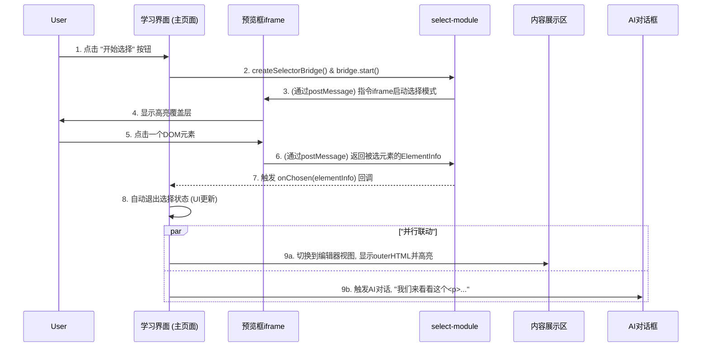

### **详细技术设计文档 (TDD-II-05): 核心学习界面 (页面2)**

**版本:** 1.2
**关联的顶层TDD:** V1.2 - 章节 2.4, 3.2
**作者:** 曹欣卓
**日期:** 2025-7-29

#### **1. 功能概述 (Feature Overview)**

**目标:** 创建一个沉浸式、交互式的三栏学习环境。用户可以在此界面查看与特定知识点相关的**示例代码**和**知识讲解**，并通过一个**交互式的DOM元素选择器**来探索示例网页，触发AI助教的上下文感知对话。

**核心原则:**
*   **探索式学习:** 核心交互是“点击预览 -> 获得讲解”，鼓励用户主动探索。
*   **模块化与复用:** 最大限度地复用组件，如AI对话框的UI逻辑、`select-module`等。
*   **只读模式:** 本界面的主要目的是“学习”和“理解”，而非“编码”，因此代码编辑器应为只读状态。

**范围:**
1.  页面初始化逻辑，包括加载学习内容和设置不可编辑的Monaco编辑器。
2.  集成`select-module`以实现跨`iframe`的DOM元素选择功能。
3.  设计“开始选择/取消选择”按钮的UI状态管理。
4.  实现选择元素后，内容展示区（编辑器视图/知识讲解视图）和AI对话框的联动逻辑。

#### **2. 设计与实现**

##### **2.1. 核心交互流程图 (DOM选择联动)**

这张图详细描绘了从用户点击“开始选择”到所有面板完成联动的完整流程。



##### **2.2. 页面初始化与内容加载**

*   **API依赖:** `GET /api/v1/learning-content/{topic_id}` (来自TDD-II-04)。
*   **前端逻辑 (`frontend/js/pages/learning_page.js`):**
    1.  从URL解析`topic_id`。
    2.  调用API获取学习内容 `{ code: {html, css, js}, documentation_md }`。
    3.  **Monaco编辑器设置:**
        *   将获取到的`code.html`, `code.css`, `code.js`加载到各自的Monaco编辑器实例中。
        *   **关键:** 设置编辑器的`readOnly`选项为`true`。
            ```javascript
            monaco.editor.create(document.getElementById('editor-container'), {
                value: htmlCode,
                language: 'html',
                readOnly: true, // 设置为只读
                // ... 其他配置
            });
            ```
    4.  **内容展示区初始化:**
        *   默认显示知识讲解视图。使用`marked.js`等库将`documentation_md`渲染为HTML，并注入到内容展示区的知识讲解`div`中。
    5.  **`<iframe>`预览框设置:**
        *   **关键决策:** <u>不使用</u>`live_preview.js`模块，因为此处的代码是固定的。直接构造一次`iframe`内容即可。
        *   在构造`iframe`的HTML时，**必须**引入并初始化`select-module`的`iframe`端逻辑。
            ```javascript
            // 构造iframe内容的逻辑
            function setupIframe(htmlCode, cssCode, jsCode) {
                const iframe = document.getElementById('preview-iframe');
              
                // 引入select-module的iframe端脚本
                // select-module打包后有一个可直接引用的JS文件
                const selectorScript = `<script src="/path/to/select-module.iframe.js"></script>`;

                const iframeContent = `
                    <html>
                      <head>
                        <style>${cssCode}</style>
                        ${selectorScript} 
                      </head>
                      <body>${htmlCode}</body>
                      <script>${jsCode}</script>
                    </html>
                `;
                iframe.srcdoc = iframeContent;
            }
            ```

##### **2.3. DOM元素选择功能实现**

*   **依赖:** `select-module` (已安装)。
*   **HTML:**
    ```html
    <button id="start-select-btn">开始选择</button>
    <button id="cancel-select-btn" style="display:none;">取消选择</button>
    ```
*   **前端逻辑 (`frontend/js/pages/learning_page.js`):**
    ```javascript
    import { createSelectorBridge } from 'select-module';

    const startBtn = document.getElementById('start-select-btn');
    const cancelBtn = document.getElementById('cancel-select-btn');
    const iframe = document.getElementById('preview-iframe');
    let selectorBridge = null;
  
    function enterSelectionMode() {
        startBtn.style.display = 'none';
        cancelBtn.style.display = 'inline-block';
      
        selectorBridge = createSelectorBridge({
            iframeWindow: iframe.contentWindow,
            targetOrigin: '*', // 开发时用'*'，生产环境应设为具体域名
            onChosen: (elementInfo) => {
                // **核心联动逻辑**
                handleElementSelection(elementInfo);
                // 选择后自动退出选择模式
                exitSelectionMode();
            },
        });
        selectorBridge.start();
    }

    function exitSelectionMode() {
        if (selectorBridge) {
            selectorBridge.stop();
            selectorBridge.destroy();
            selectorBridge = null;
        }
        startBtn.style.display = 'inline-block';
        cancelBtn.style.display = 'none';
    }
  
    startBtn.onclick = enterSelectionMode;
    cancelBtn.onclick = exitSelectionMode;
    ```

##### **2.4. 联动交互实现**

*   **`handleElementSelection(elementInfo)` 函数:**
    ```javascript
    function handleElementSelection(elementInfo) {
        // 1. 切换并更新内容展示区
        const contentArea = document.getElementById('content-area');
        const editorView = contentArea.querySelector('.editor-view');
        const knowledgeView = contentArea.querySelector('.knowledge-view');
      
        knowledgeView.style.display = 'none';
        editorView.style.display = 'block';

        // 将选中元素的outerHTML加载到专用的Monaco编辑器中
        // 假设有一个 `selected_element_editor` 实例
        selected_element_editor.setValue(elementInfo.outerHTML);
      
        // **高亮与滚动逻辑**
        // Monaco Editor API支持查找和高亮文本。
        // 找到outerHTML中的tagName进行高亮。
        const match = selected_element_editor.getModel().findNextMatch(elementInfo.tagName, {startColumn:1, lineNumber:1}, false, true, null, false);
        if (match) {
            selected_element_editor.setSelection(match.range);
            // 滚动到视图中央
            selected_element_editor.revealRangeInCenter(match.range, monaco.editor.ScrollType.Smooth);
        }

        // 2. 触发AI对话
        const aiMessage = `好的，我们来详细看看这个 \`<${elementInfo.tagName.toLowerCase()}>\` 标签。`;
        // 调用AI对话模块的函数
        window.chatUI.addMessage('system', aiMessage); // 假设chatUI模块暴露了此方法
    }
    ```

##### **2.5. 代码复用**

*   **AI对话框:**
    *   **决策:** AI对话框的**所有UI逻辑**（消息渲染、Markdown解析、加载状态管理、发送按钮事件）应该被封装到一个独立的JS模块中（例如 `frontend/js/modules/chat_ui.js`）。
    *   **实现:** 学习界面和测试界面都将导入并使用这个模块。它们各自负责**构建请求体**（因为上下文不同），但**调用的是同一个** `chatUI.sendMessage(requestBody)` 函数。

---

**总结:**
通过**集成现有的`select-module`**，我们高效地实现了核心的DOM选择功能。设计明确了**只读编辑器**和**双视图内容展示区**的概念，并通过清晰的**状态管理**（选择中/非选择中）和**事件处理**，实现了所有面板的流畅联动。最重要的是，通过**提倡模块化和代码复用**（特别是AI对话框UI）。