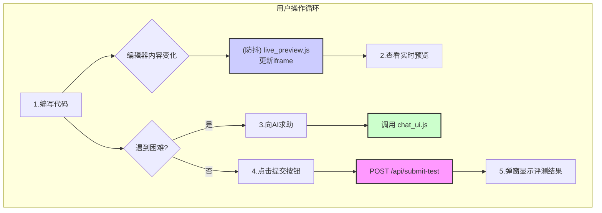

### **详细技术设计文档 (TDD-II-06): 编码测试界面 (页面3)**

**版本:** 1.2
**关联的顶层TDD:** V1.2 - 章节 2.4, 3.2
**作者:** 曹欣卓
**日期:** 2025-7-29

#### **1. 功能概述 (Feature Overview)**

**目标:** 提供一个功能完备的在线编码环境，让学习者可以完成针对特定知识点的编程任务并获得即时反馈。系统需要提供实时代码预览、安全的自动化评测，并将评测结果反馈给用户和后端的学习者模型。

**核心原则:**

* **动手实践:** 与学习界面不同，此界面的核心是“编码”，编辑器必须是可编辑的。
* **即时反馈:** 用户的代码修改应能实时反映在预览中，提交后应能立刻获得评测结果。
* **无缝衔接:** 从学习界面到测试界面，再到AI求助，用户体验应保持高度一致。

**范围:**

1. 页面初始化逻辑，包括加载测试任务和设置可编辑的Monaco编辑器。
2. 集成`live_preview.js`模块，实现编辑器与预览区的实时联动。
3. 实现代码提交、评测结果展示的完整流程。
4. 复用`chat_ui.js`模块，提供与学习界面一致的AI求助体验。

#### **2. 设计与实现**

##### **2.1. 编码测试界面工作流程图**

这张图描绘了用户在该界面上的主要操作循环：编码、预览、求助、提交。



##### **2.2. 页面初始化**

* **API依赖:** `GET /api/v1/test-tasks/{topic_id}` (来自TDD-II-04)。
* **前端逻辑 (`frontend/js/pages/test_page.js`):**
  1. 从URL解析`topic_id`。
  2. 调用API获取测试任务 `{ description_md, start_code }`。
  3. **任务描述区:** 使用`marked.js`将`description_md`渲染并显示。
  4. **Monaco编辑器设置:**
     * 将获取到的`start_code`加载到各自的Monaco编辑器实例中。
     * **关键:** 确保`readOnly`选项为`false`或不设置。
  5. **实时预览集成:**
     * **关键决策:** 我们将使用一个**可复用的实时预览模块** (`live_preview.js`) 来处理编辑器和预览框之间的联动。这个模块同样会被学习界面（页面2）用于实现其双向交互。
     * 调用 `createLivePreview` 函数，传入编辑器实例和`iframe`元素，建立联动。
 ```javascript
     // frontend/js/pages/test_page.js
     import { createLivePreview } from '../modules/live_preview.js'; // 假设该模块已存在

     // ... 在获取到数据并设置好编辑器后 ...
     const editors = { html: htmlEditor, css: cssEditor, js: jsEditor };
     const iframe = document.getElementById('preview-iframe');
     const livePreviewManager = createLivePreview(editors, iframe);

     // 触发一次初始渲染
     livePreviewManager.triggerUpdate();
     ```
  6. **AI对话框初始化:**
     * 初始化复用的`chat_ui.js`模块。

##### **2.3. 代码提交与结果反馈**

* **API依赖:** `POST /api/v1/submit-test`。
* **前端逻辑 (`frontend/js/pages/test_page.js`):**
  ```javascript
  const submitButton = document.getElementById('submit-button');
  const topicId = new URLSearchParams(window.location.search).get('topic');

  submitButton.addEventListener('click', async () => {
      submitButton.disabled = true;
      submitButton.textContent = '批改中...';
    
      // 准备请求体
      const submissionData = {
          topic_id: topicId,
          code: {
              html: htmlEditor.getValue(),
              css: cssEditor.getValue(),
              js: jsEditor.getValue()
          }
      };

      try {
          // 调用封装好的API客户端
          const result = await window.apiClient.post('/submit-test', submissionData);

          if (result.code === 200) {
              const testResult = result.data;
              // 通过一个美观的模态框或alert显示结果
              displayTestResult(testResult);

              // 如果通过，可以自动更新本地进度并跳转
              if (testResult.passed) {
                  // (可选) 更新本地状态，然后跳转回知识图谱
                  setTimeout(() => {
                      window.location.href = '/knowledge_graph.html';
                  }, 3000);
              }
          } else {
              throw new Error(result.message);
          }

      } catch (error) {
          // ... 错误处理 ...
      } finally {
          submitButton.disabled = false;
          submitButton.textContent = '提交';
      }
  });

  function displayTestResult(result) {
      let message = result.passed ? '✅ 恭喜！所有测试点都通过了！' : '❌ 很遗憾，部分测试点未通过。';
      if (result.details && result.details.length > 0) {
          message += '\n\n详细信息:\n' + result.details.join('\n');
      }
      alert(message); // 在实际项目中会用一个漂亮的模态框代替
  }
  ```
* **后端实现:** 后端评测逻辑的核心在`SandboxService`中，我们将在后续的TDD-II-08中详细设计。此处的API端点主要负责接收请求、调用服务并返回结果。

##### **2.4. AI 求助流程**

* **复用模块:** `frontend/js/modules/chat_ui.js`。
* **上下文构建:** 这是测试界面与学习界面的唯一区别。在`chat_ui.js`的`sendMessage`被调用前，需要构建一个包含**测试任务上下文**的请求体。
  ```javascript
  // 在 chat_ui.js 的 sendMessage 函数被调用时，由 test_page.js 传入上下文
  function buildChatRequestBody(userMessage) {
      return {
          user_message: userMessage,
          conversation_history: getChatHistoryFromUI(),
          code_context: {
              html: htmlEditor.getValue(),
              css: cssEditor.getValue(),
              js: jsEditor.getValue()
          },
          // **关键区别:** 上下文是测试任务ID
          task_context: `test:${getTopicIdFromUrl()}` 
      };
  }
  ```
  **设计决策:** 在`task_context`中加入`test:`前缀，可以让后端的`PromptGenerator`明确知道用户当前处于测试场景，从而调整AI的教学策略（例如，更倾向于给提示而不是直接给代码）。

***

**总结:**
通过**大量复用**我们之前设计的`live_preview.js`和`chat_ui.js`模块，开发工作被大大简化，并保证了用户体验的一致性。设计的核心在于**定义了清晰的评测提交流程**和**差异化的AI对话上下文**。这个界面成功地将用户的被动学习转化为主动实践，并为后台的学习者模型提供了最宝贵的评估数据，是整个教学闭环中不可或缺的一环。

