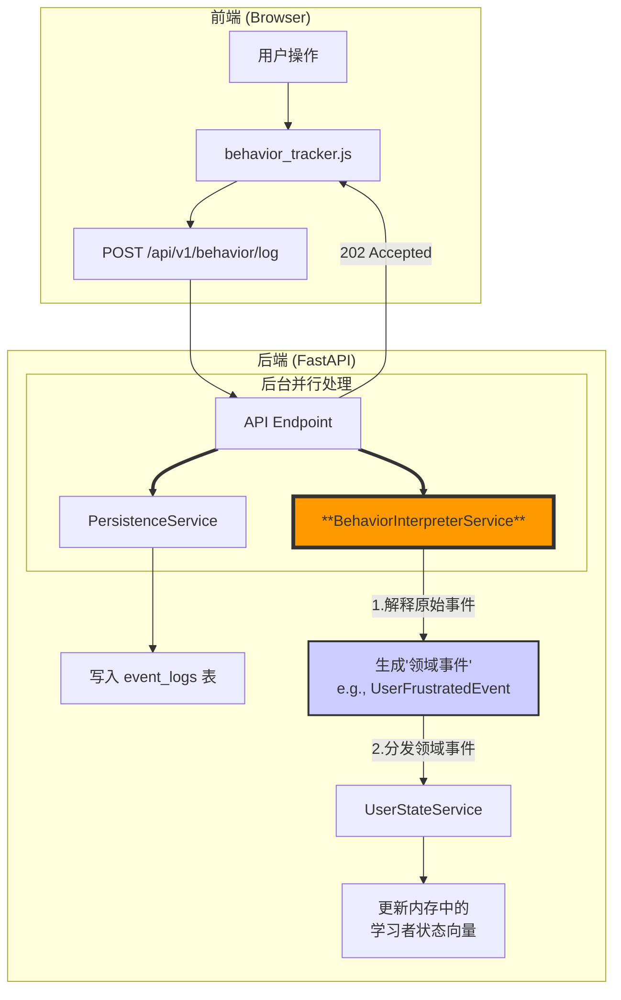
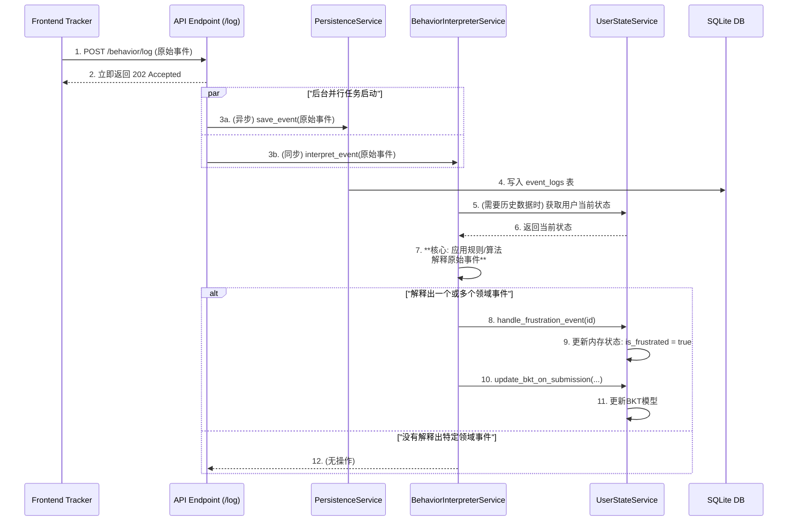

### **技术设计文档 (TDD-II-07): 行为追踪与日志系统**

**版本:** 1.2
**关联的顶层TDD:** V1.2 - 章节 2.4, 3.1, 3.2
**作者:** 曹欣卓
**日期:** 2025-7-29

#### **1. 功能概述 (Feature Overview)**

**目标:** 构建一个能够**全面、低侵入性地**捕获学习者在前端所有关键行为的追踪系统，并将其结构化地、可靠地发送到后端进行持久化存储。这份原始行为日志是所有后续学习者建模、数据分析和科研工作的基石。

**核心原则:**
*   **全面捕获:** 追踪器应能捕获对理解学习者状态有价值的多种事件，包括编码行为、交互行为和元认知行为（如页面焦点变化）。
*   **性能优先:** 前端追踪绝不能影响页面的响应速度和流畅度。必须采用防抖（Debounce）、节流（Throttle）和异步发送等策略。
*   **数据驱动建模:** 后端接收到的每一个行为事件，都将作为输入，实时驱动`UserStateService`中内存模型的更新。

**范围:**
1.  设计前端`behavior_tracker.js`模块，定义需要捕获的关键事件及其数据结构。
2.  设计`POST /api/v1/behavior/log`端点的详细实现，包括其如何与`PersistenceService`和`UserStateService`交互。

#### **2. 设计与实现**

##### **2.1. 行为追踪与处理流程图**

这张图描绘了一个用户行为从被前端捕获，到最终影响后端内存模型并被存入数据库的完整生命周期。




##### **2.2. 前端实现: `behavior_tracker.js` 模块**

*   **位置:** `frontend/js/modules/behavior_tracker.js`
*   **关键事件定义:** 我们将捕获以下事件，并为每个事件定义其`event_data`结构。

| Event Type (事件类型)    | 触发时机              | 关键 `event_data` 字段                                  | 性能策略                  |
| :------------------- | :---------------- | :-------------------------------------------------- | :-------------------- |
| `code_edit`          | Monaco编辑器内容发生变化   | `{ "editorName": "html/css/js", "newLength": ... }` | **防抖 (Debounce)**, 2秒 |
| `ai_help_request`    | 用户点击“发送”按钮向AI提问   | `{ "message": "..." }`                              | 即时发送                  |
| `test_submission`    | 用户点击“提交”按钮评测代码    | `{ "topic_id": "...", "code": {...} }`              | 即时发送                  |
| `dom_element_select` | 用户在学习界面选择了一个DOM元素 | `{ "tagName": "...", "selector": "..." }`           | 即时发送                  |
| `user_idle`          | 用户在页面无任何操作超过阈值    | `{ "duration_ms": 60000 }`                          | `setTimeout`          |
| `page_focus_change`  | 用户切换浏览器标签页或窗口     | `{ "status": "blur" / "focus" }`                    | 即时发送                  |

*   **实现代码骨架:**
    ```javascript
    // frontend/js/modules/behavior_tracker.js
    import { getParticipantId } from './session.js';
    import { debounce } from 'lodash-es';
  
    class BehaviorTracker {
      constructor() { /* ... 初始化 ... */ }
  
      // 公共发送方法
      logEvent(eventType, eventData = {}) {
        const participantId = getParticipantId();
        if (!participantId) return; // 如果没有会话，则不追踪
      
        const payload = {
          participant_id: participantId,
          event_type: eventType,
          event_data: eventData
        };
      
        // 使用 navigator.sendBeacon 或 fetch(..., { keepalive: true })
        // 确保在页面关闭前也能成功发送日志
        fetch('/api/v1/behavior/log', {
          method: 'POST',
          headers: { 'Content-Type': 'application/json' },
          body: JSON.stringify(payload),
          keepalive: true
        });
      }
  
      initEventListeners(editors) {
        // --- 代码编辑 ---
        const debouncedCodeLog = debounce((editorName, code) => {
          this.logEvent('code_edit', { editorName, newLength: code.length });
        }, 2000);
        editors.html.onDidChangeModelContent(e => debouncedCodeLog('html', editors.html.getValue()));
        // ... (css, js)

        // --- 闲置和焦点 ---
        // ... (实现 user_idle, page_focus_change 的监听逻辑) ...
      }
    }
  
    // 其他模块通过调用 window.tracker.logEvent() 来手动触发事件
    // 例如，在 chat_ui.js 中
    // window.tracker.logEvent('ai_help_request', { message: userMessage });
    ```

##### 2.3. 后端实现

* **API端点 (`backend/app/api/endpoints/behavior.py`):**
  API端点的职责现在是分发给`PersistenceService`和新的`BehaviorInterpreterService`。
  ```python
  # backend/app/api/endpoints/behavior.py
  from app.services import behavior_interpreter_service

  @router.post("/log", status_code=status.HTTP_202_ACCEPTED)
  def log_behavior(event_in: BehaviorEvent, ...):
      # 任务1: 异步持久化
      background_tasks.add_task(crud_event.create_from_behavior, db=db, obj_in=event_in)
    
      # 任务2: 将事件交给解释器处理
      behavior_interpreter_service.interpret_event(event_in)
    
      return {"status": "event received for processing"}
  ```

* **新增: 行为解释服务 (`backend/services/behavior_interpreter_service.py`):**
  这是我们新增的核心模块，里面包含了所有的规则。

  ```python
  # backend/services/behavior_interpreter_service.py
  from app.services import user_state_service # 依赖UserStateService来分发事件

  class BehaviorInterpreterService:
      def interpret_event(self, event: BehaviorEvent):
          """
          接收原始行为事件，应用规则，并触发高层领域事件。
          """
          # 在这里，我们可以从UserStateService获取该用户的历史行为数据来进行判断
          # profile = user_state_service._get_or_create_profile(event.participant_id)
        
          if event.event_type == 'test_submission' and event.event_data.get('passed') is False:
              # 在这里实现复杂的挫败感判断逻辑
              is_frustrated = self._check_frustration(profile, event.timestamp)
              if is_frustrated:
                  # 触发一个明确的领域事件
                  user_state_service.handle_frustration_event(event.participant_id)

          # ... 其他事件的解释逻辑 ...

      def _check_frustration(self, profile, timestamp) -> bool:
          # PRD中的规则: 过去2分钟内错误率 > 75% 且 提交间隔 < 10秒
          # 这里可以实现这个算法，它现在被封装和隔离了。
          # ...
          return True # or False

  behavior_interpreter_service = BehaviorInterpreterService()
  ```

* **重构: 用户状态服务 (`backend/app/services/user_state_service.py`):**
  `UserStateService`现在变得非常“傻瓜”，只负责执行明确的指令。

  ```python
  # backend/app/services/user_state_service.py
  class StudentModelService:
      # ... (_get_or_create_profile, get_model_summary 等方法保持不变) ...

      # **不再有庞大的 update_from_behavior 方法**
      # 取而代之的是一系列具体事件的处理器

      def handle_frustration_event(self, participant_id: str):
          """处理用户感到挫败的事件"""
          profile = self._get_or_create_profile(participant_id)
          profile.emotion_state['is_frustrated'] = True
          print(f"INFO: Participant {participant_id} is now marked as FRUSTRATED.")

      def handle_confusion_event(self, participant_id: str):
          """处理用户感到困惑的事件"""
          profile = self._get_or_create_profile(participant_id)
          profile.emotion_state['is_confused'] = True
    
      def update_bkt_on_submission(self, participant_id: str, topic_id: str, is_correct: bool):
          """根据提交结果更新BKT模型"""
          profile = self._get_or_create_profile(participant_id)
          # ... 调用BKT模型更新逻辑 ...
  ```

***

**总结:**
通过**前端全面的、高性能的事件追踪**，以及**后端高效解耦的异步处理架构**，我们确保了能够捕获丰富的行为数据而又不影响用户体验。这个系统为`UserStateService`提供了源源不断的实时输入，是实现真正动态、上下文感知的自适应教学的核心基础。
同时，我们可以做到：**易于扩展和替换:**
    - 想增加新的行为模式？只需在`BehaviorInterpreterService`中增加一个`if`分支和一个处理函数。
    - 未来想把规则引擎换成一个复杂的机器学习模型？只需重写`BehaviorInterpreterService`内部的实现，而`UserStateService`和API层完全不需要改动。
