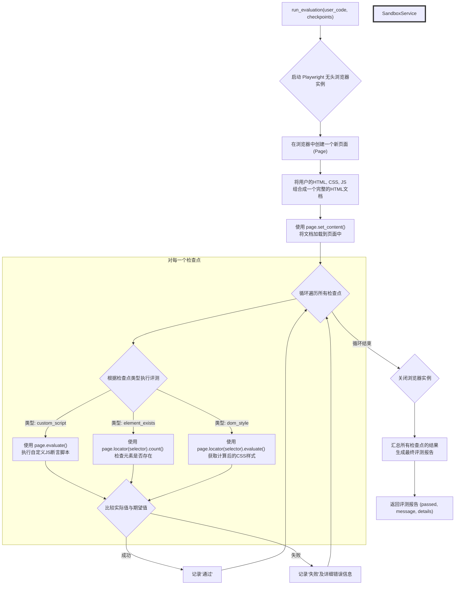
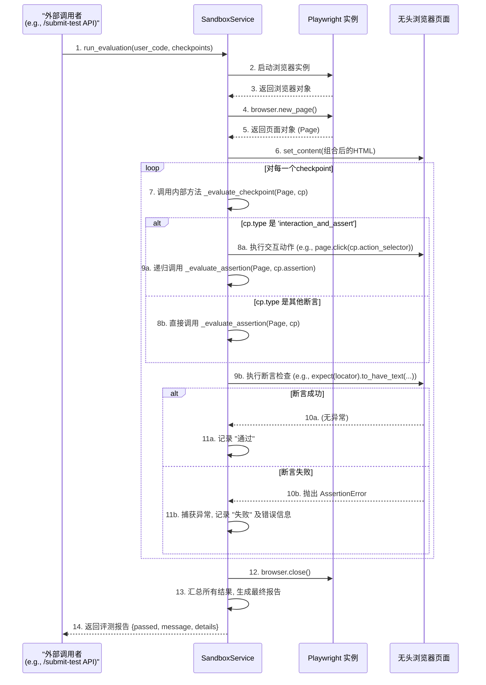

### 技术设计文档 (TDD-II-08): 安全代码评测沙箱

**版本:** 1.2
**关联的顶层TDD:** V1.2 - 章节 2.3 (技术选型), 3.2 (API接口规范)
**作者:** 曹欣卓
**日期:** 2025-7-28

#### **1. 功能概述 (Feature Overview)**

**目标:** 设计并实现一个**安全、可靠、高效**的服务器端代码评测服务。该服务能够接收用户提交的前端代码（HTML, CSS, JS），在一个完全隔离的环境中执行它，并根据预设的检查点（Checkpoints）来判断代码是否正确，最终返回详细的评测结果。

**核心原则:**

* **安全第一 (Security First):** 沙箱环境必须与主服务器的文件系统、网络和进程完全隔离，能有效防止任意代码执行、文件系统访问、网络请求等恶意行为。
* **环境一致性 (Consistent Environment):** 沙箱的执行环境（浏览器内核）必须与用户在前端预览时使用的环境高度一致，确保“所见即所得”的评测结果。
* **可扩展检查点 (Extensible Checkpoints):** 评测逻辑应由一系列可扩展的“检查点”数据驱动，方便未来增加新的评测类型而无需修改核心服务代码。
* 功能契约验证 (Functional Contract Verification): 评测的核心是验证用户代码是否满足一系列功能性需求（例如，“点击这个按钮后，计数器应该加一”），而不是验证其DOM结构或CSS写法的具体细节。

**范围:**

1. 选择并确认沙箱技术（Playwright）。
2. 设计`SandboxService`的核心方法`run_evaluation`的详细实现逻辑。
3. 定义支持的检查点类型及其数据结构。

#### **2. 设计与实现**

##### **2.1. 沙箱评测流程图与时序图**



##### **2.2. 检查点类型定义**

| `type`                                       | 描述                                                              | `checkpoint` 必需字段                                                                                                                         | 示例                                                                                                                                                                                     |
| :------------------------------------------- | :-------------------------------------------------------------- | :---------------------------------------------------------------------------------------------------------------------------------------- | :------------------------------------------------------------------------------------------------------------------------------------------------------------------------------------- |
| **`assert_style`** (替代`dom_style`)           | **断言样式（功能性）**。检查一个元素是否**满足**某个样式条件，而不是完全等于。例如，检查字体大小是否“大于16px”。 | `selector`, `css_property`, `assertion_type` (`equals`, `contains`, `greater_than`, `less_than`), `value`                                 | `{"type": "assert_style", "selector": ".title", "css_property": "font-size", "assertion_type": "greater_than", "value": "16px"}`                                                       |
| **`assert_attribute`**                       | **断言属性**。检查一个元素的某个HTML属性是否存在或其值是否符合预期。                          | `selector`, `attribute`, `assertion_type` (`exists`, `equals`, `contains`), `value` (可选)                                                  | `{"type": "assert_attribute", "selector": "img", "attribute": "alt", "assertion_type": "exists"}`                                                                                      |
| **`assert_text_content`** (替代`element_text`) | **断言文本内容**。检查元素的文本是否包含或匹配某个模式，而不是完全相等。                          | `selector`, `assertion_type` (`contains`, `matches_regex`), `value`                                                                       | `{"type": "assert_text_content", "selector": "#counter", "assertion_type": "matches_regex", "value": "Count: \\d+"}`                                                                   |
| **`interaction_and_assert`**                 | **交互后断言 (最重要的)**。模拟一个用户行为（如点击），然后对页面的变化进行断言。这用于测试动态功能。          | `action_selector`, `action_type` (`click`, `hover`, `type_text`), `action_value` (可选, for `type_text`), `assertion` (一个嵌套的断言对象，可以是上述任何一种) | `{"type": "interaction_and_assert", "action_selector": "#add-btn", "action_type": "click", "assertion": {"type": "assert_text_content", "selector": "#counter", "value": "Count: 1"}}` |
| **`custom_script`**                          | **自定义脚本**。保留作为最终的“杀手锏”，用于无法用上述断言描述的复杂逻辑。                        | `script`                                                                                                                                  | `{"type": "custom_script", "script": "return document.querySelector('#a').getBoundingClientRect().top < document.querySelector('#b').getBoundingClientRect().top"}` (检查A是否在B上方)        |

*   它不关心用户是用`class`还是`id`来实现样式，只要最终元素的`font-size`大于16px就算通过。
*   它不关心用户是用`<span>Count: 1</span>`还是`<p>Count: 1</p>`，只要文本内容匹配正则表达式就算通过。
*   它通过`interaction_and_assert`，能够测试JavaScript的动态行为，这对于组件测试至关重要。
##### **2.3. 后端服务实现 (`backend/services/sandbox_service.py`)**

* **依赖安装:** `poetry add playwright` 并在首次运行时执行 `playwright install`。
* **服务代码:**

  ```python
  # backend/services/sandbox_service.py
  from playwright.sync_api import sync_playwright, Page, expect, PlaywrightException
  from typing import Dict, Any, List

  class SandboxService:
      def run_evaluation(self, user_code: Dict[str, str], checkpoints: List[Dict[str, Any]]) -> Dict[str, Any]:
          results = []
          passed_all = True

          try:
              with sync_playwright() as p:
                  browser = p.chromium.launch()
                  page = browser.new_page()
                
                  full_html = f"""
                  <!DOCTYPE html><html><head><style>{user_code.get('css', '')}</style></head>
                  <body>{user_code.get('html', '')}</body>
                  <script>{user_code.get('js', '')}</script></html>
                  """
                  page.set_content(full_html, wait_until="load") # 等待页面加载完成

                  for i, cp in enumerate(checkpoints):
                      passed, detail = self._evaluate_checkpoint(page, cp)
                      if not passed:
                          passed_all = False
                          # 如果检查点有自定义反馈，使用它，否则用默认的
                          feedback = cp.get("feedback", detail)
                          results.append(f"检查点 {i+1} 失败: {feedback}")
                
                  browser.close()
          except PlaywrightException as e:
              return {"passed": False, "message": "评测服务发生内部错误。", "details": [str(e)]}

          message = "恭喜！所有测试点都通过了！" if passed_all else "很遗憾，部分测试点未通过。"
          return {"passed": passed_all, "message": message, "details": results}

    def _evaluate_checkpoint(self, page: Page, checkpoint: Dict[str, Any]) -> (bool, str):
        cp_type = checkpoint.get("type")
        try:
            # --- 执行交互 (如果需要) ---
            if cp_type == "interaction_and_assert":
                action_type = checkpoint.get("action_type")
                action_selector = checkpoint.get("action_selector")
                if action_type == "click":
                    page.locator(action_selector).click()
                # ... 其他交互类型 ...
              
                # 交互后，对嵌套的断言进行评估
                return self._evaluate_assertion(page, checkpoint.get("assertion"))
            else:
                # 如果不是交互式检查点，直接评估断言
                return self._evaluate_assertion(page, checkpoint)

        except Exception as e:
            return False, f"执行检查点时发生错误: {e}"

    def _evaluate_assertion(self, page: Page, assertion: Dict[str, Any]) -> (bool, str):
        """
        一个专门处理各种断言的私有方法。
        """
        assertion_type = assertion.get("type")
        selector = assertion.get("selector")
      
        try:
            if assertion_type == "assert_style":
                # 这里需要写更复杂的逻辑来处理 'greater_than' 等情况
                # actual_value = page.locator(selector).evaluate(...)
                # if assertion['assertion_type'] == 'greater_than':
                #     return float(actual_value.replace('px','')) > float(assertion['value'].replace('px',''))
                pass # 示意
          
            elif assertion_type == "assert_text_content":
                locator = page.locator(selector)
                if assertion['assertion_type'] == 'contains':
                    expect(locator).to_contain_text(assertion['value'])
                elif assertion['assertion_type'] == 'matches_regex':
                    expect(locator).to_have_text(re.compile(assertion['value']))
          
            # ... 实现其他所有断言类型的逻辑 ...
          
            return True, "通过"
        except AssertionError as e:
            return False, str(e)
        except Exception as e:
            return False, f"执行断言时发生错误: {e}"

  sandbox_service = SandboxService()
  ```

  **设计决策:** 我们大量使用了Playwright自带的`expect`断言库，它能提供非常清晰、可读的失败信息，简化了我们的评测逻辑。

***

**总结:**
通过采用**Playwright**作为核心技术，我们从根本上解决了安全隔离问题，并获得了与真实浏览器一致的评测环境。**数据驱动的、可扩展的检查点系统**使得添加新类型的测试变得简单，无需修改核心服务代码。这个`SandboxService`是连接用户实践与系统评估的桥梁，为整个自适应学习闭环提供了可靠的、自动化的考官。我们的评测沙箱现在能够真正地支持多样化和创造性的正确答案。`interaction_and_assert`检查点的引入，使得测试动态JavaScript行为成为可能。这个修正后的设计不仅对学生更公平，也更贴近真实世界的软件测试思想，极大地提升了我们项目的教育价值和技术深度。
