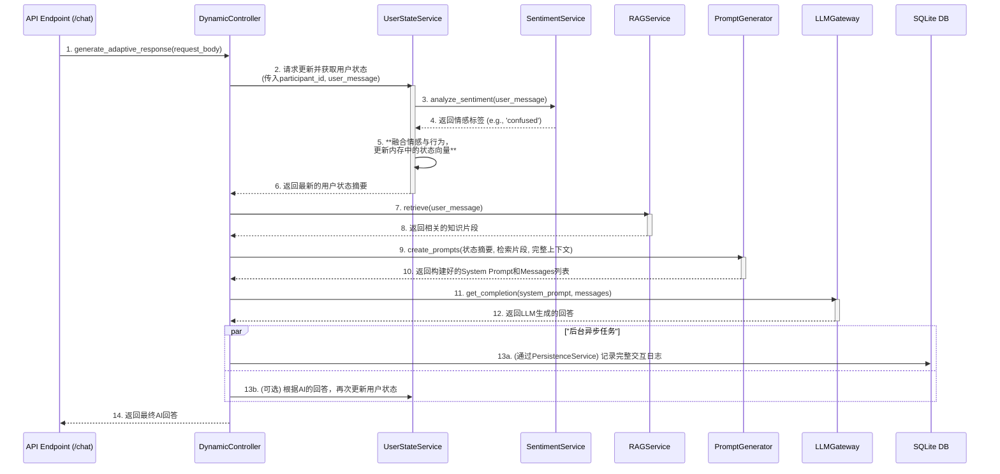

### **详细技术设计文档 (TDD-II-10): 最终的AI对话核心流程**

**版本:** 1.2
**关联的顶层TDD:** V1.2 - 所有章节
**作者:** 曹欣卓
**日期:** 2025-7-29

#### **1. 功能概述 (Feature Overview)**

**目标:** 设计并实现一个能够处理核心AI对话请求 (`POST /api/v1/ai/chat`) 的、高度智能化的后端流程。该流程负责**编排（Orchestrate）** 多个后台服务，全面地、实时地理解学习者的**情境（Context）**和**状态（State）**，并据此动态生成能够驱动LLM产生个性化、自适应教学反馈的Prompts。

**核心原则:**

* **情境与状态的融合:** 成功的设计必须能将**外显的情境**（代码、对话历史、任务）和**内隐的状态**（认知、行为、情感）无缝融合，作为LLM决策的依据。
* **清晰的编排逻辑:** `DynamicController` 作为总指挥，其调用各个服务的顺序和逻辑必须清晰、合理。
* **Prompt工程是核心:** 系统的“智能”最终体现在`PromptGenerator`所产出的高质量、上下文感知的System Prompt中。

**范围:**

1.  详细设计`POST /ai/chat`端点背后的核心服务`DynamicController`的`generate_adaptive_response`方法。
2.  明确`DynamicController`调用`UserStateService`, `SentimentAnalysisService`, `RAGService`, `PromptGenerator`, `LLMGateway`的顺序和数据传递。
3.  详细设计`PromptGenerator`如何融合所有输入信息，构建最终的System Prompt。

#### **2. 设计与实现**

##### **2.1. AI对话核心流程时序图 (Orchestration Sequence Diagram)**



##### **2.2. 核心服务实现 (`backend/services/dynamic_controller.py`)**

`DynamicController`是无状态的编排器，它的方法接收所有需要的信息。

```python
# backend/services/dynamic_controller.py
from app.schemas.chat import ChatRequest, ChatResponse
from . import user_state_service, rag_service, prompt_generator, llm_gateway, persistence_service

class DynamicController:
    async def generate_adaptive_response(self, request: ChatRequest, db) -> str:
        # 步骤 2-6: 获取全面的、最新的用户状态摘要
        # 这一步包含了情感分析和状态更新的内部逻辑
        state_summary = user_state_service.get_updated_summary(
            db=db,
            participant_id=request.participant_id,
            user_message=request.user_message
        )

        # 步骤 7-8: RAG检索
        retrieved_context = rag_service.retrieve(request.user_message)

        # 步骤 9-10: 动态生成Prompts
        system_prompt, messages = prompt_generator.create_prompts(
            user_state=state_summary,
            retrieved_context=retrieved_context,
            conversation_history=request.conversation_history,
            user_message=request.user_message,
            code_context=request.code_context,
            task_context=request.task_context
        )

        # 步骤 11-12: 调用LLM
        ai_response_content = await llm_gateway.get_completion(system_prompt, messages)
      
        # 步骤 13: 异步记录日志
        persistence_service.log_chat_interaction(
            db=db,
            request=request,
            system_prompt=system_prompt,
            ai_response=ai_response_content
        )

        # 步骤 14: 返回结果
        return ai_response_content

dynamic_controller = DynamicController()
```
**设计决策:** `user_state_service`暴露一个更高层次的方法`get_updated_summary`，该方法内部封装了调用`SentimentAnalysisService`和更新内存状态的逻辑，使`DynamicController`的调用更简洁。

##### **2.3. 动态Prompt生成器实现 (`backend/services/prompt_generator.py`)**

这是将所有信息转化为prompt的地方。

```python
# backend/services/prompt_generator.py

class PromptGenerator:
    def create_prompts(self, user_state: dict, retrieved_context: list, ...) -> (str, list):
      
        # --- 1. 构建 System Prompt ---
        system_prompt = self._build_system_prompt(user_state, retrieved_context, task_context)
      
        # --- 2. 构建 Messages 列表 ---
        # messages列表包含了对话历史和用户最新的提问
        messages = self._build_message_history(conversation_history, code_context, user_message)
      
        return system_prompt, messages

    def _build_system_prompt(self, user_state, retrieved_context, task_context) -> str:
        # --- 角色和总体目标 ---
        prompt_parts = [
            "You are 'Alex', a world-class AI programming tutor. Your goal is to help a student master a specific topic by providing personalized, empathetic, and insightful guidance. You must respond in Markdown."
        ]
      
        # --- 教学策略指令 (基于用户状态) ---
        emotion = user_state.get('emotion', {}).get('label', 'NEUTRAL').upper()
        if emotion == 'FRUSTRATED':
            prompt_parts.append("STRATEGY: The student seems frustrated. Your top priority is to be encouraging and empathetic. Acknowledge the difficulty before offering help. Use phrases like 'Don't worry, this is a tricky part' or 'Let's try a different approach'.")
        elif emotion == 'CONFUSED':
            prompt_parts.append("STRATEGY: The student seems confused. Break down concepts into smaller, simpler steps. Use analogies. Provide the simplest possible examples. Avoid jargon.")
      
        # ... 可以加入更多基于BKT模型和行为状态的策略 ...

        # --- RAG上下文指令 ---
        if retrieved_context:
            formatted_context = "\n\n---\n\n".join(retrieved_context)
            prompt_parts.append(f"REFERENCE KNOWLEDGE: Use the following information from the knowledge base to answer the user's question accurately.\n\n{formatted_context}")

        # --- 任务上下文指令 ---
        prompt_parts.append(f"TASK CONTEXT: The student is currently working on the topic: '{task_context}'. Frame your explanations within this context.")

        return "\n\n".join(prompt_parts)

    def _build_message_history(self, history, code, user_message) -> list:
        # 构造一个符合OpenAI ChatCompletion格式的messages列表
        messages = [{"role": "system", "content": "..."}] # system prompt内容稍后注入
      
        # 添加历史对话
        for msg in history:
            messages.append({"role": msg.role, "content": msg.content})
          
        # 将当前代码和用户最新问题组合成最后一条用户消息
        latest_user_content = f"""
Here is my current code:
---HTML---
{code.html}
---CSS---
{code.css}
---JS---
{code.js}
---
My question is: {user_message}
"""
        messages.append({"role": "user", "content": latest_user_content})
        return messages

prompt_generator = PromptGenerator()
```

***

**总结:**
设计了AI对话这一核心功能的**编排逻辑**和**智能核心（Prompt工程）**。通过一个清晰的`DynamicController`，我们将多个独立的后台服务有机地组织起来，实现了**状态理解、信息检索和响应生成**的完整流程。`PromptGenerator`的设计将我们所有的研究思想（对用户状态的洞察）转化为对LLM具体、可执行的教学策略，是实现“自适应”教学理念的最终体现。至此，我们系统最复杂、最核心的部分已经设计完毕。