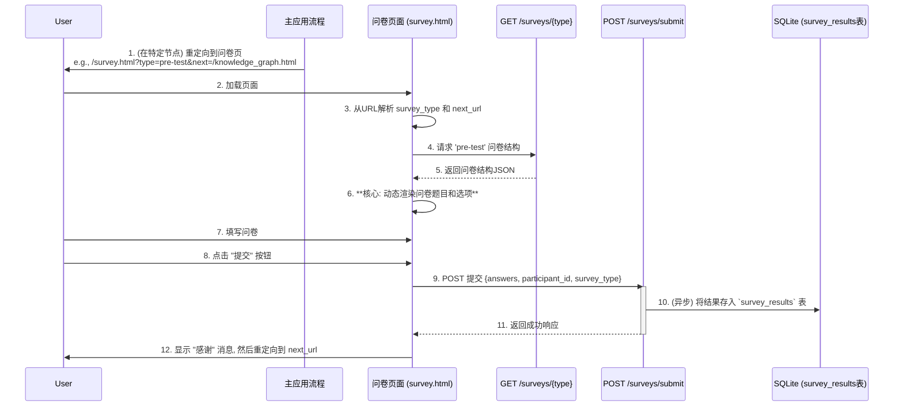

### **详细技术设计文档 (TDD-II-11): 问卷系统**

**版本:** 1.2
**关联的顶层TDD:** V1.2 - 章节 3.1 (数据库设计), 3.2 (API接口规范)
**作者:** 曹欣卓
**日期:** 2025-7-28

#### **1. 功能概述 (Feature Overview)**

**目标:** 构建一个灵活的、数据驱动的在线问卷系统，用于部署实验所需的前后测问卷以及所有用户体验量表（如NASA-TLX、感知个性化量表等）。该系统必须能可靠地展示问卷、收集用户的回答，并将其与对应的参与者ID关联后存入数据库。

**核心原则:**

*   **数据驱动:** 问卷的题目、类型和选项都应从后端API动态加载，而不是在前端硬编码，以便于未来修改和扩展。
*   **数据完整性:** 确保每一份提交的问卷数据都能准确无误地与参与者关联，并被完整地记录下来。
*   **流程无缝整合:** 问卷的呈现必须无缝地整合到用户的核心学习流程中，在恰当的时机（如实验开始前、结束后）引导用户完成。

**范围:**

1.  设计`GET /api/v1/surveys/{type}` 和 `POST /api/v1/surveys/submit` 两个API。
2.  设计一个通用的前端问卷渲染页面 (`survey.html`)，能够根据API返回的JSON动态生成不同类型的问卷。
3.  规划问卷在主应用流程中的嵌入点。

#### **2. 设计与实现**

##### **2.1. 问卷系统流程时序图 (Sequence Diagram)**

这张图详细描绘了用户被引导至问卷、填写并提交的完整流程。


**设计决策:** 在URL中增加一个`next`参数，如`?type=pre-test&next=/knowledge_graph.html`。这使得问卷系统成为一个可复用的“中间件”，完成任务后可以灵活地将用户导向任何下一个页面，增强了流程的可配置性。

##### **2.2. 后端实现 (FastAPI)**

*   **API 1: 获取问卷结构**
    *   **Endpoint:** `GET /api/v1/surveys/{survey_type}`
    *   **实现:** 与TDD-II-04中的内容服务类似，从静态JSON文件 (`backend/data/surveys/{survey_type}.json`) 读取并返回数据。
    *   **问卷JSON结构 (`nasa-tlx.json` 示例):**
        ```json
        {
          "survey_type": "nasa-tlx",
          "title": "NASA-TLX 认知负荷量表",
          "description": "请根据您刚刚完成的任务的体验，在以下每个维度上进行评分。",
          "questions": [
            {
              "id": "mental_demand",
              "type": "likert-21",
              "text": "脑力需求 (Mental Demand)",
              "options": { "low_label": "非常低", "high_label": "非常高" }
            },
            {
              "id": "physical_demand",
              "type": "likert-21",
              "text": "体力需求 (Physical Demand)",
              "options": { "low_label": "非常低", "high_label": "非常高" }
            }
            // ... 其他NASA-TLX维度
          ]
        }
        ```

*   **API 2: 提交问卷答案**
    *   **Endpoint:** `POST /api/v1/surveys/submit`
    *   **Pydantic Schema (`backend/app/schemas/survey.py`):**
        ```python
        class SurveySubmissionRequest(BaseModel):
            participant_id: str
            survey_type: str
            answers: Dict[str, Any] # e.g., {"q1": "div", "q2": 4}
        ```
    *   **端点逻辑 (`backend/app/api/endpoints/surveys.py`):**
        ```python
        @router.post("/submit", response_model=StandardResponse)
        def submit_survey(
            submission: SurveySubmissionRequest,
            background_tasks: BackgroundTasks,
            db: Session = Depends(get_db)
        ):
            # 异步写入数据库，快速响应前端
            background_tasks.add_task(crud_survey.create, db=db, obj_in=submission)
            return StandardResponse(message="Survey submitted successfully.")
        ```

##### **2.3. 前端实现 (JavaScript)**

*   **通用问卷页面 (`frontend/survey.html` & `frontend/js/pages/survey.js`):**

    ```javascript
    // frontend/js/pages/survey.js
    import { getParticipantId } from '../modules/session.js';

    document.addEventListener('DOMContentLoaded', async () => {
        const urlParams = new URLSearchParams(window.location.search);
        const surveyType = urlParams.get('type');
        const nextUrl = urlParams.get('next') || '/knowledge_graph.html'; // 默认跳转地址

        const participantId = getParticipantId();
        if (!participantId) { window.location.href = '/index.html'; return; }
      
        // 1. 获取并渲染问卷
        const response = await fetch(`/api/v1/surveys/${surveyType}`);
        const result = await response.json();
        renderSurvey(result.data); // 调用渲染函数

        // 2. 绑定提交事件
        document.getElementById('submit-survey-btn').addEventListener('click', async () => {
            const answers = getAnswersFromForm(); // 从表单收集答案
            const submission = { participant_id: participantId, survey_type: surveyType, answers };

            await fetch('/api/v1/surveys/submit', { /* ... POST ... */ });
          
            alert('感谢您的参与！');
            window.location.href = nextUrl; // 跳转到指定页面
        });
    });

    function renderSurvey(surveyData) {
        // ... 根据surveyData.questions数组动态创建HTML元素
        //    需要一个switch语句来处理不同type的题目（multiple-choice, likert-21等）
    }

    function getAnswersFromForm() { /* ... 从表单元素中提取数据并格式化为对象 ... */ }
    ```

*   **流程整合点:**
    1.  **注册后 (TDD-II-02):**
        *   在`registration.js`中，注册成功后跳转到:
          `window.location.href = '/survey.html?type=pre-test&next=/knowledge_graph.html';`
    2.  **实验结束后:**
        *   在知识图谱页，当检测到所有节点都已完成，或者用户点击了“完成实验”按钮时，可以依次引导用户完成多个问卷。
          ```javascript
          // 伪代码
          function onExperimentComplete() {
              // 第一个问卷：后测
              const postTestUrl = encodeURIComponent('/survey.html?type=nasa-tlx&next=/thank-you.html');
              window.location.href = `/survey.html?type=post-test&next=${postTestUrl}`;
          }
          ```
          这里通过将下一个问卷的URL作为`next`参数，形成了一个“问卷链”，可以引导用户连续完成多个问卷。

***

**总结:**
补充了至关重要的**数据回收能力**。通过设计一个**数据驱动的、可复用的问卷系统**，我们能够灵活地部署和管理所有科研所需的量表。**可配置的`next`参数**使得问卷可以作为独立的“中间件”无缝地嵌入到用户流程的任何节点，极大地增强了实验流程的灵活性和可扩展性。这个系统的完成，确保了我们能够收集到所有必要的衡量指标，为最终的论文撰写提供坚实的数据支持。