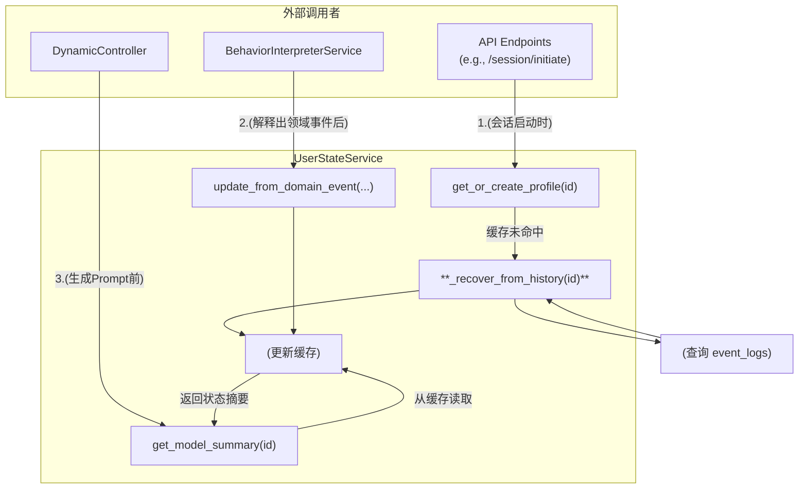

### 技术设计文档 (TDD-II-12): UserStateService 内部设计与恢复机制

**版本:** 1.3
**关联的顶层TDD:** V1.2 - 核心服务层
**作者:** 曹欣卓
**日期:** 2025-7-29

**更新记录:**
*   **v1.3 (2025-8-2):** 增加了基于快照的状态恢复优化机制，以提高大量历史事件用户的恢复性能。

#### **1. 功能概述 (Feature Overview)**

**目标:** 详细设计`UserStateService`的内部工作机制，重点关注其**内存状态管理**、**与其它服务的交互**以及**从持久化日志中恢复状态**的能力。

**核心原则:**

* **内存优先 (In-Memory First):** 所有的实时读写操作都针对内存中的状态对象，以保证极致性能。
* **事件溯源 (Event Sourcing):** 用户的当前状态，可以被看作是其所有历史行为事件作用于一个初始状态后的最终结果。这是状态恢复的理论基础。
* **懒加载恢复 (Lazy Recovery):** 状态恢复是一个相对耗时的操作，它只应该在用户首次访问或服务重启后该用户首次访问时被触发，而不是在每次API请求时都执行。

#### **2. 设计与实现**

##### **2.1. UserStateService 内部状态与交互图**



##### **2.2. `StudentProfile` 内存对象**

这是存储在`_state_cache`字典中的值，它代表一个用户的完整状态。

```python
# backend/app/services/user_state_service.py
class StudentProfile:
    def __init__(self, participant_id):
        self.participant_id = participant_id
        # 认知状态
        self.bkt_model = {} # { 'topic_id': BKT_instance }
        # 情感状态
        self.emotion_state = {'current_sentiment': 'NEUTRAL', 'is_frustrated': False, ...}
        # 行为状态
        self.behavior_counters = {
            'submission_timestamps': [],
            'error_count': 0,
            # ... 其他需要跨请求追踪的计数器
        }
```

##### **2.3. 状态恢复机制的详细实现**

* **`get_or_create_profile` 方法 (入口点):**
  这个方法是所有外部服务与`UserStateService`交互的入口。

  ```python
  # backend/app/services/user_state_service.py
  class UserStateService:
      def __init__(self):
          self._state_cache: Dict[str, StudentProfile] = {}
          # 引入解释器，用于回放
          from . import behavior_interpreter_service
          self.interpreter = behavior_interpreter_service

      def get_or_create_profile(self, participant_id: str, db: Session) -> StudentProfile:
          if participant_id not in self._state_cache:
              print(f"INFO: Cache miss for {participant_id}. Attempting recovery from history.")
              self._recover_from_history(participant_id, db)
        
          # 如果恢复后仍然没有（说明是全新用户），则创建一个空的
          if participant_id not in self._state_cache:
              self._state_cache[participant_id] = StudentProfile(participant_id)

          return self._state_cache[participant_id]
  ```

* **`_recover_from_history` 方法 (核心恢复逻辑):**

  ```python
  # backend/app/services/user_state_service.py
  from app.crud import crud_event

  class UserStateService:
      # ...
      def _recover_from_history(self, participant_id: str, db: Session):
          # 1. 查询该用户的所有历史事件
          historical_events = crud_event.get_by_participant(db, participant_id=participant_id)
        
          if not historical_events:
              return # 没有历史，无需恢复

          print(f"INFO: Found {len(historical_events)} events for {participant_id}. Replaying...")

          # 2. 创建一个临时的空profile
          # 注意：在回放期间，我们不希望触发任何外部调用（如写数据库）
          # 因此，解释器可能需要一个“回放模式”的开关
          temp_profile = StudentProfile(participant_id)
          self._state_cache[participant_id] = temp_profile # 先放入缓存，让解释器能找到它

          # 3. 遍历并“回放”事件
          for event in historical_events:
              # 将数据库模型转换为Pydantic模型
              event_schema = BehaviorEvent.from_orm(event)
              # 调用解释器，但在回放模式下
              self.interpreter.interpret_event(event_schema, is_replay=True)
        
          print(f"INFO: Recovery complete for {participant_id}.")
  ```

  **设计决策:** `interpret_event`方法增加一个`is_replay=True`的标志。当此标志为`True`时，`BehaviorInterpreterService`在产生领域事件后，不会触发任何新的数据库写入或异步任务，只调用`UserStateService`的更新方法。

##### **2.4. 快照机制优化 (Snapshot Optimization)**

为了提高具有大量历史事件的用户的恢复性能，我们引入了快照机制。快照机制是一种优化，它定期保存用户状态的完整快照，从而减少恢复时需要回放的事件数量。

* **核心思想:**
  * 定期将内存中的`StudentProfile`对象序列化并保存到数据库中（作为特殊的`event_log`条目）
  * 恢复时，先找到最新的快照，然后只回放该快照之后的事件
  * 这样可以显著减少恢复时间，特别是对于有大量历史事件的用户

* **快照存储策略:**
  * 快照作为特殊的事件存储在`event_logs`表中
  * `event_type`为`"state_snapshot"`
  * `event_data`包含序列化的`StudentProfile`对象

* **快照创建策略:**
  * 每当用户状态更新时，检查是否需要创建新快照
  * 策略可以是：每N次更新创建一次快照，或每隔M分钟创建一次快照
  * 快照创建应该是异步的，不影响主业务流程

* **快照清理策略:**
  * 为了避免存储过多快照，需要定期清理旧快照
  * 可以保留最近的几个快照，删除更早的快照

* **更新后的恢复流程:**
  ```mermaid
  graph TD
      A[开始恢复] --> B[查找最新快照]
      B --> C{找到快照?}
      C -->|是| D[从快照恢复状态]
      C -->|否| E[从初始状态开始]
      D --> F[获取快照之后的事件]
      E --> F
      F --> G[回放事件]
      G --> H[恢复完成]
  ```

* **`_recover_from_history_with_snapshot` 方法 (优化后的恢复逻辑):**
  ```python
  # backend/app/services/user_state_service.py
  from app.crud import crud_event
  from datetime import datetime, timedelta

  class UserStateService:
      # 快照创建间隔（示例：每100次事件或每30分钟）
      SNAPSHOT_EVENT_INTERVAL = 100
      SNAPSHOT_TIME_INTERVAL = timedelta(minutes=30)
      
      # ...
      def _recover_from_history_with_snapshot(self, participant_id: str, db: Session):
          # 1. 查找最新的快照
          latest_snapshot = crud_event.get_latest_snapshot(db, participant_id=participant_id)
          
          if latest_snapshot:
              # 2a. 如果找到快照，从快照恢复
              print(f"INFO: Found snapshot for {participant_id}. Restoring from snapshot...")
              # 反序列化快照数据
              profile_data = latest_snapshot.event_data
              temp_profile = StudentProfile.from_dict(profile_data)
              self._state_cache[participant_id] = temp_profile
              
              # 3a. 获取快照之后的事件
              events_after_snapshot = crud_event.get_after_timestamp(
                  db, 
                  participant_id=participant_id, 
                  timestamp=latest_snapshot.timestamp
              )
              
              print(f"INFO: Found {len(events_after_snapshot)} events to replay after snapshot for {participant_id}.")
          else:
              # 2b. 如果没有快照，从头开始
              print(f"INFO: No snapshot found for {participant_id}. Replaying from beginning...")
              temp_profile = StudentProfile(participant_id)
              self._state_cache[participant_id] = temp_profile
              
              # 3b. 获取所有历史事件
              events_after_snapshot = crud_event.get_by_participant(db, participant_id=participant_id)
              
          if not events_after_snapshot:
              print(f"INFO: No events to replay for {participant_id}.")
              return  # 没有事件需要回放
          
          # 4. 回放事件
          for event in events_after_snapshot:
              # 将数据库模型转换为Pydantic模型
              event_schema = BehaviorEvent.from_orm(event)
              # 调用解释器，但在回放模式下
              self.interpreter.interpret_event(event_schema, is_replay=True)
          
          print(f"INFO: Recovery complete for {participant_id}.")
  ```

* **`StudentProfile` 的序列化方法:**
  ```python
  # backend/app/services/user_state_service.py
  import json
  from typing import Dict, Any

  class StudentProfile:
      def __init__(self, participant_id):
          self.participant_id = participant_id
          self.bkt_model = {}  # 简化示例，实际可能需要特殊处理
          self.emotion_state = {'current_sentiment': 'NEUTRAL', 'is_frustrated': False}
          self.behavior_counters = {
              'submission_timestamps': [],
              'error_count': 0,
          }
      
      def to_dict(self) -> Dict[str, Any]:
          """将StudentProfile序列化为字典"""
          return {
              'participant_id': self.participant_id,
              'bkt_model': self.bkt_model,
              'emotion_state': self.emotion_state,
              'behavior_counters': self.behavior_counters
          }
      
      @classmethod
      def from_dict(cls, data: Dict[str, Any]) -> 'StudentProfile':
          """从字典反序列化创建StudentProfile"""
          profile = cls(data['participant_id'])
          profile.bkt_model = data.get('bkt_model', {})
          profile.emotion_state = data.get('emotion_state', {'current_sentiment': 'NEUTRAL', 'is_frustrated': False})
          profile.behavior_counters = data.get('behavior_counters', {
              'submission_timestamps': [],
              'error_count': 0,
          })
          return profile
  ```

---

**总结:**
为系统设计了一个健壮的**状态恢复机制**。利用**事件溯源**的原理，我们能够通过回放`event_logs`来精确重建用户的内存状态，解决了服务重启导致的数据丢失问题。同时，通过引入**快照机制优化**，我们进一步提升了具有大量历史事件的用户的恢复性能。将这些复杂的过程封装在`UserStateService`内部，并提供一个简单的`get_or_create_profile`接口，使得上层逻辑（如API端点）保持了简洁。
