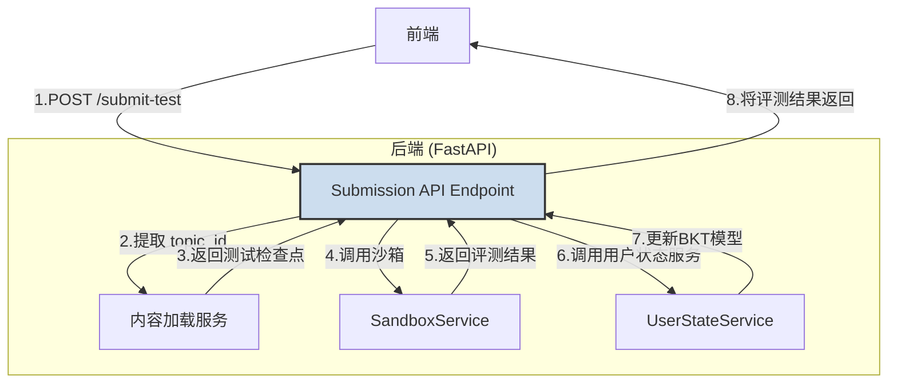
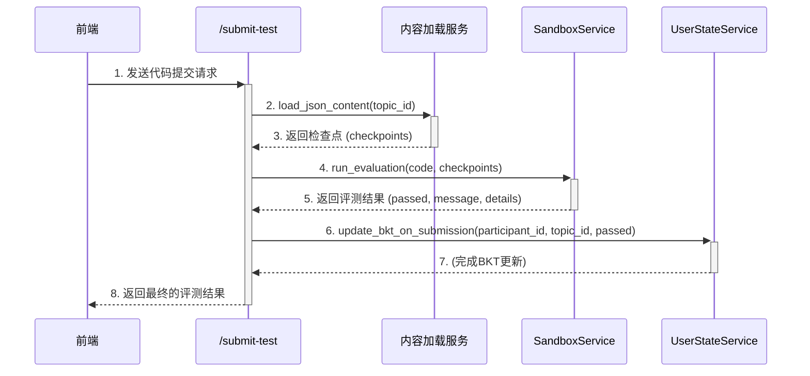

### **技术设计文档 (TDD-II-14): 代码提交与评测API**

**版本:** 1.0
**关联的顶层TDD:** V1.2 - 核心API层
**作者:** 曹欣卓
**日期:** 2025-08-03

---

#### **1. 功能概述 (Feature Overview)**

**目标:** 设计并实现一个核心API端点 `POST /api/v1/submission/submit-test`，该端点是连接前端测试界面、后端代码评测沙箱和用户状态模型的关键枢纽。

**核心职责:**
1.  接收前端发送的用户代码和相关上下文（参与者ID, 知识点ID）。
2.  调用 `SandboxService` 对代码进行安全、可靠的评测。
3.  根据评测结果（通过/失败），调用 `UserStateService` 更新对应用户的BKT（贝叶斯知识追踪）模型。
4.  将详细的评测结果返回给前端，以便向用户提供即时反馈。

---

#### **2. 设计与实现**

##### **2.1. API端点定义**

*   **方法:** `POST`
*   **路径:** `/api/v1/submission/submit-test`
*   **用途:** 提交用户编写的代码以进行自动评测。
*   **认证:** 无（依赖于请求体中的 `participant_id`）

##### **2.2. 数据模型 (Schemas)**

我们定义了严格的数据结构来确保请求和响应的类型安全。

*   **请求体 (`TestSubmissionRequest`):**
    ```json
    {
      "participant_id": "string",
      "topic_id": "string",
      "code": {
        "html": "string",
        "css": "string",
        "js": "string"
      }
    }
    ```

*   **成功响应 (`TestSubmissionResponse`):**
    ```json
    {
      "passed": "boolean",
      "message": "string",
      "details": [
        "string"
      ]
    }
    ```

##### **2.3. 业务逻辑流程图**



##### **2.4. 时序图**



---

#### **3. 实现细节与依赖**

*   **文件位置:** `backend/app/api/endpoints/submission.py`
*   **核心依赖:**
    *   `fastapi.Depends`: 用于依赖注入，获取数据库会话和 `UserStateService` 实例。
    *   `content_loader.py`: 用于根据 `topic_id` 加载对应的测试任务和检查点。
    *   `sandbox_service.py`: 用于执行代码评测。
    *   `user_state_service.py`: 用于在评测后更新用户的知识状态。

*   **错误处理:**
    *   如果请求的 `topic_id` 在内容目录中不存在，API将返回一个标准的 `404 Not Found` 错误。
    *   `SandboxService` 中发生的任何内部错误都将被捕获，并以结构化的错误信息返回给前端。

---

**总结:**

该API端点通过清晰的职责划分和对服务层的依赖调用，实现了评测流程的高度自动化和解耦。它完成了TDD-06, 08, 12之间的功能闭环