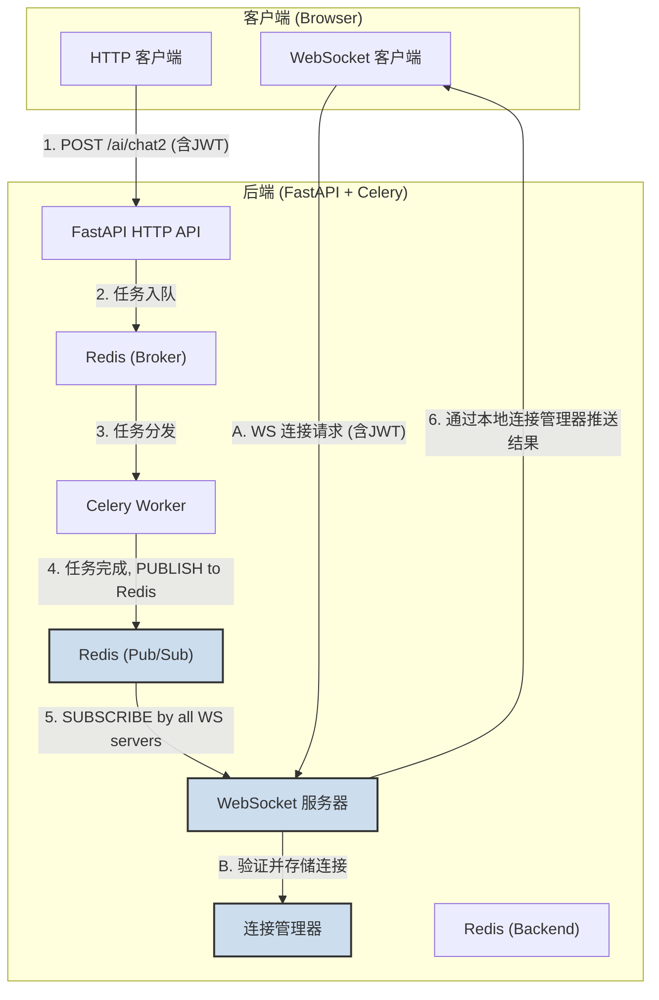

### **技术设计文档 (TDD-II-15): WebSocket 实时通知集成 (增强版)**

**版本:** 1.2
**关联的顶层TDD:** V1.2 - 核心API层, adaptive-tutor-system 异步化重构
**日期:** 2025-08-26
**状态:** 草稿

---

#### **1. 功能概述 (Feature Overview)**

**目标:** 设计并实现一个基于 WebSocket 的实时通知系统，用于将后端异步任务（如聊天响应、代码提交结果）的最终状态主动推送给前端客户端。此方案旨在保留现有的 HTTP 请求/响应模式，仅将 WebSocket 作为服务器到客户端的单向推送通道。

**核心职责:**
1.  建立并管理客户端与后端之间的 WebSocket 连接。
2.  在后端异步任务（Celery任务）完成后，根据任务与用户之间的关联，将结果通过 WebSocket 推送给正确的用户。
3.  定义清晰、可扩展的 WebSocket 消息格式。
4.  提供实时进度更新功能，让用户了解任务执行进度。

---

#### **2. 设计与实现**

##### **2.1. WebSocket 端点定义**

*   **方法:** WebSocket Upgrade
*   **路径:** `/ws/user/{participant_id}`
*   **用途:** 为已认证的用户提供一个持久的实时通信通道。
*   **认证:** 连接请求必须携带有效的 JWT Token，后端需验证 `participant_id` 与 Token 中的用户信息是否匹配。

##### **2.2. WebSocket 消息格式 (Schemas)**

为了保证消息的清晰性和可扩展性，所有通过 WebSocket 发送和接收的消息都遵循统一的 JSON 格式。

*   **通用响应消息格式 (`WebSocketResponse`):**
    ```json
    {
      "type": "string",              // 消息类型，如 "chat_result", "submission_result", "submission_progress"
      "task_id": "string",           // 关联的 Celery 任务ID (如果适用)
      "timestamp": "ISO8601 String", // 消息生成时间
      "data": {},                    // 消息体，具体内容由 `type` 决定
      "error": {                     // (可选) 如果操作失败，包含错误信息
        "code": "string",
        "message": "string"
      }
    }
    ```

*   **示例: 聊天结果 (`type: "chat_result"`):**
    ```json
    {
      "type": "chat_result",
      "task_id": "uuid-of-celery-task",
      "timestamp": "2023-10-27T10:00:00Z",
      "data": {
        "message": "AI生成的回复内容...",
        "raw_prompt_to_llm": "发送给LLM的完整Prompt"
      }
    }
    ```

*   **示例: 代码提交结果 (`type: "submission_result"`):**
    ```json
    {
      "type": "submission_result",
      "task_id": "uuid-of-celery-task",
      "timestamp": "2023-10-27T10:00:05Z",
      "data": {
        "passed": true,
        "message": "所有测试点通过！",
        "details": ["检查点1: 通过", "检查点2: 通过"]
      }
    }
    ```

*   **示例: 代码提交进度 (`type: "submission_progress"`):**
    ```json
    {
      "type": "submission_progress",
      "task_id": "uuid-of-celery-task",
      "timestamp": "2023-10-27T10:00:02Z",
      "data": {
        "stage": "sandbox_evaluation",
        "message": "正在执行代码评测...",
        "progress": 0.5
      }
    }
    ```

##### **2.3. 系统架构与数据流 (基于 Redis Pub/Sub)**



**详细流程:**

1.  **连接建立:**
    *   用户登录成功后，前端使用 `participant_id` 和 JWT Token 尝试连接到 `ws://.../ws/user/{participant_id}`。
    *   后端 `WebSocket 服务器` 验证 Token 和 `participant_id` 的有效性。
    *   验证通过后，接受连接，并将 `(participant_id, websocket_object)` 存储在**本地实例的** `连接管理器` 中。

2.  **HTTP 请求处理 (以 `/ai/chat2` 为例):**
    *   客户端通过 HTTP `POST /ai/chat2` 发送聊天请求。
    *   FastAPI 端点验证请求，调用 `process_chat_request.apply_async(...)` 将任务放入 `chat_queue`。
    *   FastAPI 立即返回 `202 Accepted` 和 `task_id` 给客户端。

3.  **任务执行与结果推送 (通过 Redis Pub/Sub):**
    *   `Celery Worker` 从 `Redis_Broker` 获取任务并执行。
    *   任务执行完毕后，将结果存储到 `Redis_Backend`。
    *   任务的最后一步是**通知机制**：Worker 将格式化后的 WebSocket 消息 `PUBLISH` 到 Redis 通道 `ws:user:{participant_id}`。
    *   **所有**运行中的 FastAPI 实例都通过后台任务 `SUBSCRIBE` 了 `ws:user:*` 通道。
    *   当某个实例收到 `participant_id` 对应的消息时，它会查找自己本地的 `连接管理器`。
    *   如果该实例持有该用户的连接，则通过 `websocket_object.send_text(json_message)` 将结果发送给客户端。
    *   如果该实例没有该用户的连接，则忽略此消息。

4.  **连接关闭:**
    *   当客户端主动断开连接或因网络问题断开时，后端需要从**本地实例的** `连接管理器` 中移除对应的 `(participant_id, websocket_object)` 条目。

---

#### **3. 核心组件实现细节**

*   **文件位置:**
    *   WebSocket 路由: `backend/app/api/endpoints/websocket.py`
    *   连接管理器: `backend/app/core/websocket_manager.py`
    *   Celery 任务通知逻辑: 在 `backend/app/tasks/chat_tasks.py` 和 `backend/app/tasks/submission_tasks.py` 的任务完成回调中。

*   **连接管理器 (`WebSocketManager`):**
    *   **职责:**
        *   存储本实例活跃的 WebSocket 连接 (`Dict[participant_id, WebSocket]`)。
        *   提供 `connect(participant_id, websocket)` 方法。
        *   提供 `disconnect(participant_id)` 方法。
        *   提供 `send_to_user(participant_id, message)` 方法，内部处理连接是否存在、是否关闭等细节。
    *   **并发安全:** 由于 FastAPI 和 WebSockets 通常运行在异步环境中，`WebSocketManager` 需要处理并发访问。将使用 `asyncio.Lock` 来保护对共享连接字典的修改操作。
        ```python
        # backend/app/core/websocket_manager.py (示例代码)
        import asyncio
        from typing import Dict
        from fastapi import WebSocket

        class WebSocketManager:
            def __init__(self):
                self.active_connections: Dict[str, WebSocket] = {}
                self._lock = asyncio.Lock() # 并发锁

            async def connect(self, participant_id: str, websocket: WebSocket):
                await websocket.accept()
                async with self._lock: # 获取锁
                    self.active_connections[participant_id] = websocket

            async def disconnect(self, participant_id: str):
                async with self._lock: # 获取锁
                    if participant_id in self.active_connections:
                        del self.active_connections[participant_id]

            async def send_to_user(self, participant_id: str, message: str):
                # 读取操作通常不需要锁，但如果怕在读取时连接被断开，也可以加上
                if participant_id in self.active_connections:
                    websocket = self.active_connections[participant_id]
                    await websocket.send_text(message)
        ```

*   **WebSocket 端点 (`websocket.py`):**
    *   使用 FastAPI 的 `@app.websocket("/ws/user/{participant_id}")` 装饰器定义路由。
    *   实现 `websocket_endpoint(websocket: WebSocket, participant_id: str)` 异步函数。
    *   在函数内部进行身份验证（例如，从 `websocket.headers` 中获取 token 并验证）。
    *   调用 `await websocket.accept()` 接受连接。
    *   将连接注册到 `WebSocketManager`。
    *   实现心跳机制以确保连接的可靠性（详见第5节）。
    *   可以实现一个简单的 `try...finally` 块来确保
    * 连接断开时能从管理器中移除。

*   **Celery 任务通知:**
    *   在 `process_chat_request` 和 `process_submission_task` 等 Celery 任务的最后，成功或失败时，都需要将格式化后的 WebSocket 消息 `redis_client.publish(f"ws:user:{participant_id}", json_message)` 到 Redis。
    *   为了关联 `task_id` 和 `participant_id`，可以在任务启动时就将 `participant_id` 作为任务的一部分数据传递，或者在任务内部始终可以访问到发起请求的用户信息。
    *   为了支持进度更新，可以在任务执行的不同阶段调用 `redis_client.publish(...)` 发送进度消息。

---

#### **4. 前端集成方案**

##### **4.1. 前端WebSocket客户端架构**

*   **核心模块**: 创建一个 `WebSocketClient` 类，封装所有WebSocket连接管理、消息处理和错误处理逻辑。
*   **单例模式**: 使用单例模式确保整个应用只有一个WebSocket连接实例。
*   **事件驱动**: 采用事件驱动的方式处理消息，通过事件订阅/发布机制将消息分发给不同的UI组件。

##### **4.2. 连接管理机制**

*   **连接初始化**: 在用户成功登录并获取到 `participant_id` 后，初始化WebSocket连接。
*   **认证机制**: 连接URL包含JWT token作为查询参数: `ws://host:port/ws/user/{participant_id}?token={jwt_token}`
*   **连接状态管理**: 维护连接状态（CONNECTING, OPEN, CLOSING, CLOSED），提供状态查询接口。
*   **自动重连**: 实现指数退避算法的自动重连机制，最大重试次数为5次。

##### **4.3. 消息处理机制**

*   **消息格式**: 所有消息都遵循统一的JSON格式，包含 `type`, `task_id`, `timestamp`, `data`, `error` 字段。
*   **消息分发**: 根据消息的 `type` 字段将消息分发给对应的处理器:
    *   `chat_result`: 聊天结果消息，更新聊天界面
    *   `submission_result`: 代码提交结果消息，更新测试结果界面
    *   `submission_progress`: 代码提交进度消息，更新进度指示器
*   **事件订阅**: 提供 `subscribe` 和 `unsubscribe` 方法，允许UI组件订阅特定类型的消息。

##### **4.4. 错误处理与重连机制**

*   **心跳机制**: 客户端需要能够响应服务器的Ping消息并发送Pong响应。
*   **网络异常处理**: 监听 `onclose` 和 `onerror` 事件，区分正常关闭和异常断开。
*   **重连策略**: 
    *   异常断开后立即尝试重连
    *   采用指数退避算法，重连间隔依次为1s, 2s, 4s, 8s, 16s
    *   最多重连5次，超过后提示用户手动刷新页面
*   **连接状态提示**: 在UI上显示连接状态，让用户了解WebSocket连接情况。

##### **4.5. 与现有UI的集成方案**

*   **聊天模块集成**: 
    *   在发送 `/ai/chat2` 请求后，保存返回的 `task_id`
    *   订阅 `chat_result` 类型消息，当收到对应 `task_id` 的消息时，更新聊天界面
    *   移除原有的轮询机制，完全依赖WebSocket推送

*   **测试页面集成**:
    *   在发送 `/submit-test2` 请求后，保存返回的 `task_id`
    *   订阅 `submission_progress` 和 `submission_result` 类型消息
    *   收到进度消息时更新进度条，收到结果消息时显示最终测试结果
    *   移除原有的轮询机制，完全依赖WebSocket推送

*   **全局状态管理**: 
    *   创建全局的WebSocket客户端实例，挂载到 `window` 对象上
    *   提供统一的消息订阅接口，供各页面组件使用

##### **4.6. 跨页面连接管理策略 (多页面应用)**

*   **问题描述**: 当前前端为多页面应用 (MPA)，当用户在不同页面间跳转时（例如，从知识图谱页面到测试页面），浏览器会进行整页刷新，导致当前页面的 WebSocket 连接被销毁。

*   **选定策略：按页重连 (Per-Page Reconnection)**
    *   **工作原理**: 当新页面加载时，其 JavaScript 代码将重新执行。我们封装的 `WebSocketClient` 模块会检测到当前无活动连接，并利用存储在 `localStorage` 中的用户凭证（`participant_id` 和 JWT Token）自动发起一个新的 WebSocket 连接。
    *   **选择原因 (Why this approach?)**:
        *   **简单且可靠**: 此方案实现简单，无需引入复杂的前端技术栈（如 Service Worker 或 Redux），与现有前端架构完全兼容。对于核心业务流（在同一页面发起任务并接收结果），此方案的可靠性非常高。
        *   **成本效益高**: 在当前项目阶段，这是一个成本效益最高的解决方案。它以最小的改动满足了核心需求，避免了大规模的前端架构重构。
        *   **风险可控**: 页面跳转期间连接中断时间很短（通常在1秒以内），消息丢失的风险极低，对于我们的异步任务通知场景是可以接受的。

*   **未来优化方向 (Alternative Solutions)**
    *   **Service Worker**: 为了实现真正的跨页面持久连接，未来可以考虑将 WebSocket 连接的管理逻辑移至 Service Worker。这能让连接在后台独立于页面运行，但会显著增加实现复杂度。
    *   **单页面应用 (SPA) 架构**: 从根本上解决此问题的最佳方案是将前端重构为单页面应用（使用 Vue, React 等框架）。在 SPA 中，页面切换由前端路由控制，不会发生整页刷新，因此 WebSocket 连接可以一直保持。

---

#### **5. 安全、可靠性与错误处理**

*   **认证:** WebSocket 连接必须严格认证，防止未授权访问。
*   **授权:** 确保 `send_to_user` 只能发送消息给正确的用户。
*   **连接可靠性 (心跳机制):** 为了及时发现和处理网络异常断开的连接，服务器端需要实现心跳检测。
    *   **实现方式**: 在 `websocket_endpoint` 中，连接建立后启动一个后台协程，定期（例如每20秒）向客户端发送 Ping 消息。
    *   **超时处理**: 如果在设定时间内（例如30秒）没有收到客户端的 Pong 响应或任何其他消息，则认为连接已断开，主动关闭连接并从 `WebSocketManager` 中移除。
    *   **客户端配合**: 客户端也需要能够响应服务器的 Ping 并发送 Pong，或能处理服务器的 Ping 作为保持连接的信号。
*   **错误处理:**
    *   WebSocket 连接异常断开时，后端应能正确清理资源。
    *   向已断开的连接发送消息时，应捕获异常并从管理器中移除该连接。
    *   **当前阶段简化**: 如果 `send_to_user` 失败（例如，用户不在线），将记录详细的错误日志用于调试和监控，但不会实现复杂的离线消息缓存和重发机制。

---

#### **6. 部署考虑**

*   **水平扩展:** 通过 Redis Pub/Sub 机制，本方案天然支持水平扩展。你可以随意增加或减少 FastAPI 服务器实例，系统都能正常工作，无需配置粘性会话。
*   **监控:** 需要监控 WebSocket 连接数、消息吞吐量以及错误日志等指标。

---

#### **7. 文件变更和新增**

##### **7.1. 新增文件**

1.  **`backend/app/core/websocket_manager.py`**
    *   实现 `WebSocketManager` 类，用于管理所有 WebSocket 连接
    *   提供连接管理、消息发送等功能

2.  **`backend/app/api/endpoints/websocket.py`**
    *   实现 WebSocket 路由端点
    *   处理连接建立、认证、消息接收等逻辑

3.  **`frontend/js/modules/websocket_client.js`**
    *   实现前端 `WebSocketClient` 类，封装WebSocket连接管理、消息处理和错误处理逻辑
    *   提供事件订阅/发布机制，支持UI组件订阅特定类型的消息

##### **7.2. 修改文件**

1.  **`backend/app/tasks/chat_tasks.py`**
    *   在任务完成后添加 Redis Pub/Sub 通知逻辑

2.  **`backend/app/tasks/submission_tasks.py`**
    *   在任务执行过程中添加进度更新通知
    *   在任务完成后添加最终结果通知

3.  **`backend/app/main.py`**
    *   注册 WebSocket 路由

4.  **`backend/app/celery_app.py`**
    *   添加对 Redis 客户端的初始化，以便 Celery 任务可以直接使用它来发布消息

5.  **`frontend/js/modules/chat.js`**
    *   集成WebSocket客户端，替换原有的轮询机制
    *   订阅 `chat_result` 类型消息，实时更新聊天界面

6.  **`frontend/js/pages/test_page.js`**
    *   集成WebSocket客户端，替换原有的轮询机制
    *   订阅 `submission_progress` 和 `submission_result` 类型消息
    *   实时更新测试进度和结果显示

---

#### **8. 测试计划**

1.  **单元测试:**
    *   测试 `WebSocketManager` 的连接管理功能
    *   测试消息发送功能

2.  **集成测试:**
    *   测试完整的 WebSocket 连接建立和消息传递流程
    *   测试与 Celery 任务的集成

3.  **性能测试:**
    *   测试大量并发 WebSocket 连接的处理能力
    *   测试消息推送的延迟和吞吐量