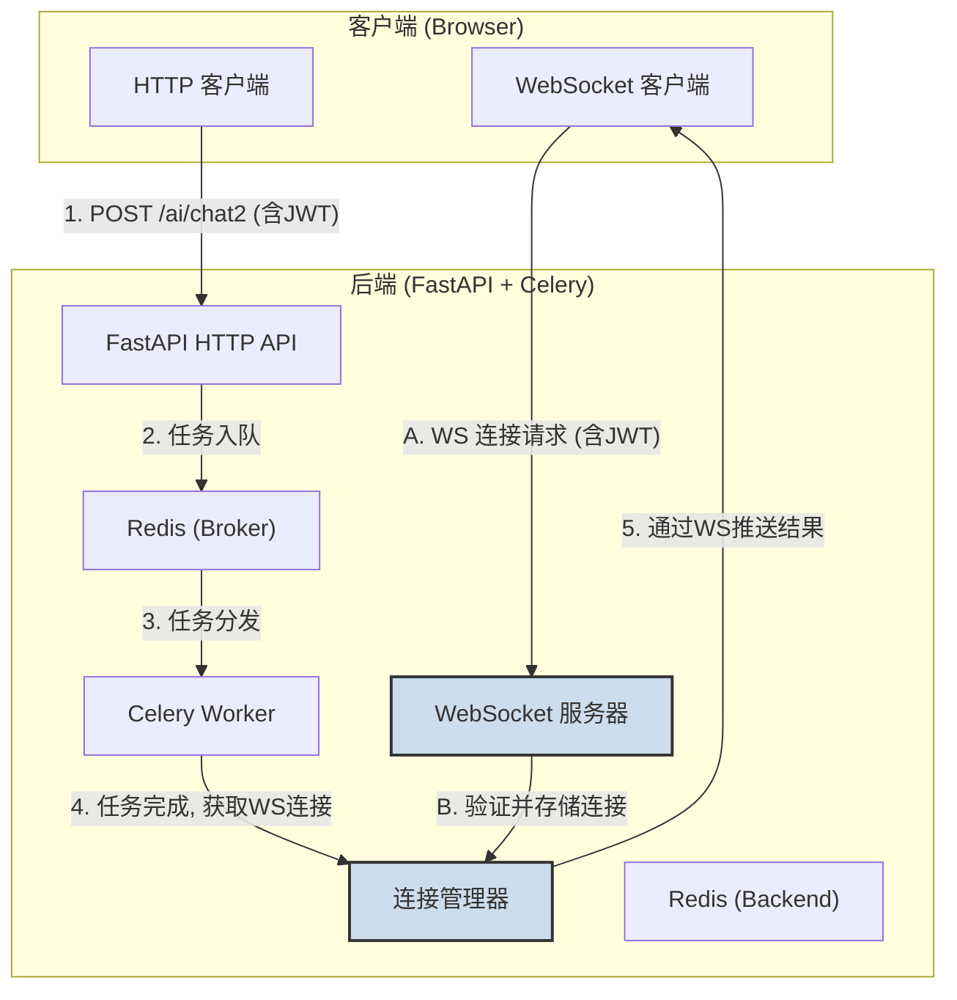

### **技术设计文档 (TDD-II-15): WebSocket 实时通知集成**

**版本:** 1.0
**关联的顶层TDD:** V1.2 - 核心API层, adaptive-tutor-system 异步化重构
**日期:** 2025-08-25
**状态:** 草稿

---

#### **1. 功能概述 (Feature Overview)**

**目标:** 设计并实现一个基于 WebSocket 的实时通知系统，用于将后端异步任务（如聊天响应、代码提交结果）的最终状态主动推送给前端客户端。此方案旨在保留现有的 HTTP 请求/响应模式，仅将 WebSocket 作为服务器到客户端的单向推送通道。

**核心职责:**
1.  建立并管理客户端与后端之间的 WebSocket 连接。
2.  在后端异步任务（Celery任务）完成后，根据任务与用户之间的关联，将结果通过 WebSocket 推送给正确的用户。
3.  定义清晰、可扩展的 WebSocket 消息格式。

---

#### **2. 设计与实现**

##### **2.1. WebSocket 端点定义**

*   **方法:** WebSocket Upgrade
*   **路径:** `/ws/user/{participant_id}`
*   **用途:** 为已认证的用户提供一个持久的实时通信通道。
*   **认证:** 连接请求必须携带有效的 JWT Token，后端需验证 `participant_id` 与 Token 中的用户信息是否匹配。

##### **2.2. WebSocket 消息格式 (Schemas)**

为了保证消息的清晰性和可扩展性，所有通过 WebSocket 发送和接收的消息都遵循统一的 JSON 格式。

*   **通用响应消息格式 (`WebSocketResponse`):**
    ```json
    {
      "type": "string",              // 消息类型，如 "chat_result", "submission_result", "submission_progress"
      "task_id": "string",           // 关联的 Celery 任务ID (如果适用)
      "request_id": "string",        // (可选) 客户端发起请求时提供的唯一ID，用于匹配响应
      "timestamp": "ISO8601 String", // 消息生成时间
      "data": {},                    // 消息体，具体内容由 `type` 决定
      "error": {                     // (可选) 如果操作失败，包含错误信息
        "code": "string",
        "message": "string"
      }
    }
    ```

*   **示例: 聊天结果 (`type: "chat_result"`):**
    ```json
    {
      "type": "chat_result",
      "task_id": "uuid-of-celery-task",
      "request_id": "client-generated-id-123",
      "timestamp": "2023-10-27T10:00:00Z",
      "data": {
        "message": "AI生成的回复内容...",
        "raw_prompt_to_llm": "发送给LLM的完整Prompt"
      }
    }
    ```

*   **示例: 代码提交结果 (`type: "submission_result"`):**
    ```json
    {
      "type": "submission_result",
      "task_id": "uuid-of-celery-task",
      "request_id": "client-generated-id-456",
      "timestamp": "2023-10-27T10:00:05Z",
      "data": {
        "passed": true,
        "message": "所有测试点通过！",
        "details": ["检查点1: 通过", "检查点2: 通过"]
      }
    }
    ```

##### **2.3. 系统架构与数据流**



**详细流程:**

1.  **连接建立:**
    *   用户登录成功后，前端使用 `participant_id` 和 JWT Token 尝试连接到 `ws://.../ws/user/{participant_id}`。
    *   后端 `WebSocket 服务器` 验证 Token 和 `participant_id` 的有效性。
    *   验证通过后，接受连接，并将 `(participant_id, websocket_object)` 存储在 `连接管理器` 中。

2.  **HTTP 请求处理 (以 `/ai/chat2` 为例):**
    *   客户端通过 HTTP `POST /ai/chat2` 发送聊天请求。
    *   FastAPI 端点验证请求，调用 `process_chat_request.apply_async(...)` 将任务放入 `chat_queue`。
    *   FastAPI 立即返回 `202 Accepted` 和 `task_id` 给客户端。

3.  **任务执行与结果推送:**
    *   `Celery Worker` 从 `Redis_Broker` 获取任务并执行。
    *   任务执行完毕后，将结果存储到 `Redis_Backend`。
    *   任务的最后一步是**通知机制**：Worker 从任务结果中获取 `participant_id`。
    *   Worker 调用 `连接管理器` 的 `send_to_user(participant_id, message)` 方法。
    *   `连接管理器` 根据 `participant_id` 找到对应的 `websocket_object`。
    *   `连接管理器` 通过 `websocket_object.send_text(json_message)` 将格式化后的结果发送给客户端。

4.  **连接关闭:**
    *   当客户端主动断开连接或因网络问题断开时，后端需要从 `连接管理器` 中移除对应的 `(participant_id, websocket_object)` 条目。

---

#### **3. 核心组件实现细节**

*   **文件位置:**
    *   WebSocket 路由: `backend/app/api/endpoints/websocket.py`
    *   连接管理器: `backend/app/core/websocket_manager.py`
    *   Celery 任务通知逻辑: 在 `backend/app/tasks/chat_tasks.py` 和 `backend/app/tasks/submission_tasks.py` 的任务完成回调中。

*   **连接管理器 (`WebSocketManager`):**
    *   **职责:**
        *   存储活跃的 WebSocket 连接 (`Dict[participant_id, WebSocket]`)。
        *   提供 `connect(participant_id, websocket)` 方法。
        *   提供 `disconnect(participant_id)` 方法。
        *   提供 `send_to_user(participant_id, message)` 方法，内部处理连接是否存在、是否关闭等细节。
    *   **并发安全:** 由于 FastAPI 和 WebSockets 通常运行在异步环境中，`WebSocketManager` 需要处理并发访问。可以使用 `asyncio.Lock` 或线程安全的数据结构（如果底层存储支持）。

*   **WebSocket 端点 (`websocket.py`):**
    *   使用 FastAPI 的 `@app.websocket("/ws/user/{participant_id}")` 装饰器定义路由。
    *   实现 `websocket_endpoint(websocket: WebSocket, participant_id: str)` 异步函数。
    *   在函数内部进行身份验证（例如，从 `websocket.headers` 中获取 token 并验证）。
    *   调用 `await websocket.accept()` 接受连接。
    *   将连接注册到 `WebSocketManager`。
    *   可以实现一个简单的 `try...finally` 块来确保连接断开时能从管理器中移除。

*   **Celery 任务通知:**
    *   在 `process_chat_request` 和 `process_submission_task` 等 Celery 任务的最后，成功或失败时，都需要调用 `WebSocketManager.send_to_user()`。
    *   为了关联 `task_id` 和 `participant_id`，可以在任务启动时就将 `participant_id` 作为任务的一部分数据传递，或者在任务内部始终可以访问到发起请求的用户信息。

---

#### **4. 前端集成建议**

*   **连接管理:** 在用户登录成功后，初始化 WebSocket 连接。建议封装一个 WebSocket 客户端管理模块。
*   **消息处理:** 监听 `onmessage` 事件，根据 `message.data.type` 分发处理逻辑。
*   **请求关联:** 客户端在发送 HTTP 请求时，可以生成一个 `request_id` 并随请求一起发送（例如，在请求体或 headers 中）。当收到对应的 WebSocket 消息时，可以通过 `request_id` 匹配到原始请求，更新UI。

---

#### **5. 安全与错误处理**

*   **认证:** WebSocket 连接必须严格认证，防止未授权访问。
*   **授权:** 确保 `send_to_user` 只能发送消息给正确的用户。
*   **错误处理:**
    *   WebSocket 连接异常断开时，后端应能正确清理资源。
    *   向已断开的连接发送消息时，应捕获异常并从管理器中移除该连接。
    *   如果 `send_to_user` 失败（例如，用户不在线），应有降级策略（如记录日志）。

---